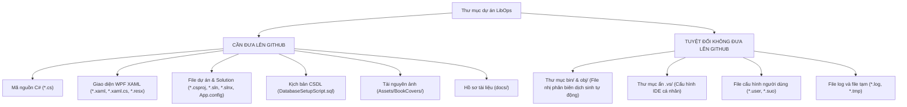

# HƯỚNG DẪN ĐẨY SOURCE CODE LÊN GITHUB, CÀI ĐẶT VÀ VẬN HÀNH HỆ THỐNG LIB_OPS

> **Dự án:** Xây Dựng Hệ Thống LibOps - Quản Lý Thư Viện.
> **Nền tảng:** C# WPF (.NET Framework 4.7.2), SQL Server LocalDB  
> **Mục đích tài liệu:** Hướng dẫn từng bước chi tiết từ khâu chuẩn bị đưa mã nguồn lên GitHub, tải về trên máy mới, cấu hình cơ sở dữ liệu và vận hành hệ thống thành công 100%.

---

## MỤC LỤC
1. [Phần 1: Chuẩn Bị & Đưa Mã Nguồn Lên GitHub](#phần-1-chuẩn-bị--đưa-mã-nguồn-lên-github)
   - [1.1. Cần đưa những gì lên và không đưa những gì lên?](#11-cần-đưa-những-gì-lên-và-không-đưa-những-gì-lên)
   - [1.2. Tạo tệp tin cấu hình loại trừ `.gitignore`](#12-tạo-tệp-tin-cấu-hình-loại-trừ-gitignore)
   - [1.3. Các bước thực hiện đẩy code lên GitHub](#13-các-bước-thực-hiện-đẩy-code-lên-github)
2. [Phần 2: Yêu Cầu Môi Trường & Tải Code Về Máy Mới (Clone)](#phần-2-yêu-cầu-môi-trường--tải-code-về-máy-mới-clone)
   - [2.1. Yêu cầu cấu hình & phần mềm cần cài đặt](#21-yêu-cầu-cấu-hình--phần-mềm-cần-cài-đặt)
   - [2.2. Tải mã nguồn từ GitHub về máy](#22-tải-mã-nguồn-từ-github-về-máy)
3. [Phần 3: Khởi Tạo & Nạp Cơ Sở Dữ Liệu (Database Setup)](#phần-3-khởi-tạo--nạp-cơ-sở-dữ-liệu-database-setup)
   - [3.1. Nạp CSDL bằng SQL Server Management Studio (SSMS)](#31-nạp-csdl-bằng-sql-server-management-studio-ssms)
   - [3.2. Nạp CSDL siêu nhanh bằng dòng lệnh `sqlcmd`](#32-nạp-csdl-siêu-nhanh-bằng-dòng-lệnh-sqlcmd)
   - [3.3. Kiểm tra chuỗi kết nối trong `App.config`](#33-kiểm-tra-chuỗi-kết-nối-trong-appconfig)
4. [Phần 4: Biên Dịch & Khởi Chạy Ứng Dụng](#phần-4-biên-dịch--khởi-chạy-ứng-dụng)
   - [4.1. Khởi chạy bằng Visual Studio](#41-khởi-chạy-bằng-visual-studio)
   - [4.2. Biên dịch và chạy bằng dòng lệnh CLI / PowerShell](#42-biên-dịch-và-chạy-bằng-dòng-lệnh-cli--powershell)
5. [Phần 5: Danh Sách Tài Khoản Đăng Nhập Mặc Định](#phần-5-danh-sách-tài-khoản-đăng-nhập-mặc-định)
6. [Phần 6: Khắc Phục Các Sự Cố Thường Gặp (Troubleshooting)](#phần-6-khắc-phục-các-sự-cố-thường-gặp-troubleshooting)

---

## PHẦN 1: CHUẨN BỊ & ĐƯA MÃ NGUỒN LÊN GITHUB

### 1.1. Cần đưa những gì lên và không đưa những gì lên?

Khi làm việc với dự án .NET / Visual Studio, bạn cần nắm rõ quy tắc quản lý mã nguồn của Git:



#### ✅ Những thành phần CẦN đưa lên GitHub:
1. **Mã nguồn logic & Giao diện:** Toàn bộ file `.cs`, `.xaml`, `.xaml.cs`, `.resx` trong các thư mục `BusinessLogicLayer`, `DataAccessLayer`, `DataModels`, `PresentationLayer`, `CommonUtilities`.
2. **File cấu hình dự án:** `LibOps.csproj`, `LibOps.slnx` (hoặc `LibOps.sln`), `packages.config`, `App.config`.
3. **Cơ sở dữ liệu mẫu:** Tệp `LibOps/Database/DatabaseSetupScript.sql` (Chứa toàn bộ 16 bảng và dữ liệu mẫu thực tế).
4. **Tài nguyên ảnh bìa sách:** Thư mục `LibOps/Assets/BookCovers/` (Chứa 50 hình ảnh bìa sách thực tế hiển thị trên phần mềm).
5. **Hồ sơ tài liệu:** Thư mục `docs/` chứa các bản vẽ kiến trúc, thiết kế CSDL và đặc tả chức năng.

#### ❌ Những thành phần TUYỆT ĐỐI KHÔNG đưa lên GitHub (Phải ignore):
1. **`bin/` và `obj/`:** Chứa file `.exe`, `.dll`, `.pdb` sinh ra khi biên dịch. Đưa lên sẽ gây nặng repository và xung đột mã nguồn khi người khác tải về biên dịch.
2. **`.vs/`:** Thư mục ẩn chứa cache và cài đặt cá nhân của Visual Studio trên máy bạn.
3. **`*.user`, `*.suo`:** File lưu trạng thái cửa sổ của người dùng.
4. **`*.log`, `*.tmp`:** Các file log và file tạm sinh ra trong quá trình chạy thử nghiệm.

---

### 1.2. Tạo tệp tin cấu hình loại trừ `.gitignore`

Tại thư mục gốc của dự án (`d:\Phenikaa\Dotnet\LibOps\`), hãy tạo một tệp tin tên là **`.gitignore`** (không có phần mở rộng) với nội dung chuẩn cho dự án C# .NET như sau:

```gitignore
## Visual Studio & Build Outputs
[Bb]in/
[Oo]bj/
[Ll]og/
[Ll]ogs/
.vs/
.idea/
.vscode/
*.user
*.suo
*.userosscache
*.sln.docstates

## Build & Test Results
[Dd]ebug/
[Rr]elease/
x64/
x86/
build/
bld/
[Tt]ests/
TestResults/
*.pdb
*.ilk
*.aps

## Temporary Files
*.tmp
*.bak
*.[Cc]ache
*.log

## AI Tools
.agents/
.gemini/
```

---

### 1.3. Các bước thực hiện đẩy code lên GitHub

Bạn mở terminal (PowerShell, Command Prompt hoặc Git Bash) tại thư mục gốc của dự án `d:\Phenikaa\Dotnet\LibOps\` và chạy lần lượt các lệnh sau:

#### Bước 1: Khởi tạo Git Repository cục bộ (nếu chưa khởi tạo)
```powershell
git init
```

#### Bước 2: Thêm các tệp tin vào khu vực chuẩn bị (Staging)
```powershell
git add .
```
*(Git sẽ tự động đọc file `.gitignore` và bỏ qua toàn bộ thư mục `bin`, `obj`, `.vs`).*

#### Bước 3: Kiểm tra trạng thái danh sách file được commit
```powershell
git status
```
*(Đảm bảo chỉ có các file mã nguồn `.cs`, `.sql`, `Assets/`, `docs/`, `App.config`, `.csproj`... Không có file trong `bin/` hay `obj/`).*

#### Bước 4: Tạo bản đóng gói commit đầu tiên
```powershell
git commit -m "feat: Khoi tao du an Quan ly thu vien LibOps - Day du Source Code, CSDL Mau va Tai Lieu"
```

#### Bước 5: Đặt tên nhánh chính là `main`
```powershell
git branch -M main
```

#### Bước 6: Liên kết với Repository trên GitHub của bạn
*Trước tiên, bạn vào [GitHub.com](https://github.com) $\rightarrow$ Nhấn nút **New Repository** $\rightarrow$ Đặt tên repo (ví dụ: `LibOps-LibraryManagement`) $\rightarrow$ Chọn chế độ **Public** hoặc **Private** $\rightarrow$ Bấm **Create repository**.*

Sau đó copy URL của repo và chạy lệnh:
```powershell
git remote add origin https://github.com/<tai-khoan-github-cua-ban>/<ten-repo>.git
```

#### Bước 7: Đẩy mã nguồn lên GitHub
```powershell
git push -u origin main
```

---

## PHẦN 2: YÊU CẦU MÔI TRƯỜNG & TẢI CODE VỀ MÁY MỚI (CLONE)

Khi mang mã nguồn sang một máy tính mới (máy bạn bè, máy chấm thi hoặc máy demo), hãy thực hiện như sau:

### 2.1. Yêu cầu cấu hình & phần mềm cần cài đặt

| Thành phần | Yêu cầu tối thiểu | Khuyến nghị |
| :--- | :--- | :--- |
| **Hệ điều hành** | Windows 10 (64-bit) | Windows 10 / Windows 11 |
| **.NET Runtime** | .NET Framework 4.7.2 | .NET Framework 4.8 hoặc mới nhất (thường có sẵn trên Windows 10/11) |
| **Công cụ biên dịch** | .NET Framework SDK / Visual Studio Build Tools | **Visual Studio 2022 Community** (chọn workload *.NET desktop development*) |
| **Cơ sở dữ liệu** | **SQL Server LocalDB** (tự động có khi cài Visual Studio) | SQL Server LocalDB (`(localdb)\MSSQLLocalDB`) + SSMS / Visual Studio |

---

### 2.2. Tải mã nguồn từ GitHub về máy

Mở PowerShell / Command Prompt tại thư mục bạn muốn lưu dự án (ví dụ `D:\Projects`):

```powershell
git clone https://github.com/<tai-khoan-github-cua-ban>/<ten-repo>.git
cd <ten-repo>
```

---

## PHẦN 3: KHỞI TẠO & NẠP CƠ SỞ DỮ LIỆU (DATABASE SETUP)

Dự án sử dụng cơ sở dữ liệu **`LibOpsDb`**. Toàn bộ cấu trúc 16 bảng, khóa chính, khóa ngoại, chỉ mục hiệu năng và dữ liệu thực tế mẫu đã được đóng gói sẵn trong tệp tin:
📁 `LibOps/Database/DatabaseSetupScript.sql`

Bạn có thể chọn **1 trong 2 cách** sau để nạp CSDL:

### 3.1. Nạp CSDL bằng SQL Server Management Studio (SSMS)
1. Mở **SQL Server Management Studio (SSMS)** hoặc **Azure Data Studio**.
2. Kết nối vào Server:
   - Server name: `(localdb)\MSSQLLocalDB`
   - Authentication: Chọn `Windows Authentication`.
3. Bấm **File** $\rightarrow$ **Open** $\rightarrow$ **File...** $\rightarrow$ Chọn tệp `DatabaseSetupScript.sql` trong thư mục `LibOps/Database/`.
4. Nhấn phím **`F5`** (hoặc nút **`Execute`** trên thanh công cụ).
5. Thông báo hoàn tất: CSDL `LibOpsDb` cùng 16 bảng và toàn bộ dữ liệu mẫu đã sẵn sàng!

---

### 3.2. Nạp CSDL siêu nhanh bằng dòng lệnh `sqlcmd` (Khuyên dùng - Mất 3 giây)

Mở PowerShell tại thư mục gốc dự án và chạy 1 dòng lệnh:

```powershell
sqlcmd -S "(localdb)\MSSQLLocalDB" -f 65001 -i "LibOps\Database\DatabaseSetupScript.sql"
```
*(Tham số `-f 65001` đảm bảo nạp đúng 100% font chữ Tiếng Việt Unicode UTF-8).*

---

### 3.3. Kiểm tra chuỗi kết nối trong `App.config`

Mở file `LibOps/App.config`. Dự án được cấu hình chuẩn kết nối trực tiếp tới **SQL Server LocalDB**:

```xml
<connectionStrings>
    <add name="LibOpsDatabaseConnection" 
         connectionString="Server=(localdb)\MSSQLLocalDB;Database=LibOpsDb;Integrated Security=True;TrustServerCertificate=True;" 
         providerName="System.Data.SqlClient" />
</connectionStrings>
```

> [!TIP]
> SQL Server LocalDB là phiên bản cơ sở dữ liệu gọn nhẹ, mặc định đã được tích hợp sẵn khi cài đặt Visual Studio mà không cần cấu hình thêm hay tốn tài nguyên chạy ngầm.

---

## PHẦN 4: BIÊN DỊCH & KHỞI CHẠY ỨNG DỤNG

### 4.1. Khởi chạy bằng Visual Studio

1. Nhấp đúp vào tệp tin giải pháp **`LibOps.slnx`** (hoặc mở file dự án `LibOps/LibOps.csproj`) bằng **Visual Studio**.
2. Đảm bảo cấu hình thanh công cụ trên cùng đang là **`Debug`** hoặc **`Release`** và nền tảng là **`Any CPU`** (hoặc `x86`/`x64`).
3. Nhấn phím **`F5`** (hoặc nút **▶ Start** màu xanh).
4. Visual Studio sẽ tự động restore packages, biên dịch toàn bộ mã nguồn và cửa sổ Đăng nhập của LibOps sẽ xuất hiện.

---

### 4.2. Biên dịch và chạy bằng dòng lệnh CLI / PowerShell

Nếu bạn không muốn mở giao diện Visual Studio nặng nề:

1. Mở PowerShell tại thư mục gốc dự án và chạy lệnh build:
   ```powershell
   dotnet build LibOps\LibOps.csproj
   ```
2. Sau khi build báo `Build succeeded (0 Error(s))`, khởi chạy ứng dụng trực tiếp:
   ```powershell
   .\LibOps\bin\Debug\net472\LibOps.exe
   ```

---

## PHẦN 5: DANH SÁCH TÀI KHOẢN ĐĂNG NHẬP MẶC ĐỊNH

Hệ thống đã chuẩn bị sẵn các tài khoản thử nghiệm tương ứng với từng phân quyền:

| Phân Quyền | Tên Đăng Nhập (`Username`) | Mật Khẩu Mặc Định (`Password`) | Vai Trò & Phạm Vi Quyền Hạn |
| :--- | :---: | :---: | :--- |
| **Quản Trị Viên (Admin)** | `Admin` | `Admin@libops` | **Toàn quyền hệ thống:** Quản lý tài khoản nhân viên, phân quyền, cấu hình tham số hệ thống, mức cọc, thời hạn mượn, SMTP gửi mail tự động, báo cáo tài chính tổng quan. |
| **Thủ Thư (Librarian)** | `Librarian` | `Librarian@libops` | **Nghiệp vụ quầy:** Quản lý danh mục sách, in mã vạch bản sao, cấp thẻ thành viên, lập phiếu mượn/trả sách, thu cọc, thu phí dịch vụ, tính phạt trễ hạn & hư hại, xét duyệt yêu cầu trực tuyến. |
| **Thành Viên Cổng Tra Cứu (Reader)** | `DG20260001`<br>đến<br>`DG20260030` | `LibOps@123` | **Cổng tự phục vụ:** Độc giả đăng nhập bằng chính Mã thẻ của mình (ví dụ: `DG20260001` - Nguyễn Hoàng Long). Tra cứu sách, xem số dư cọc ký quỹ, lịch sử mượn, gửi yêu cầu xin gia hạn mượn, cập nhật CCCD hoặc xin rút cọc đóng thẻ online. |

---

## PHẦN 6: KHẮC PHỤC CÁC SỰ CỐ THƯỜNG GẶP (TROUBLESHOOTING)

### 🔴 Sự cố 1: Lỗi `Cannot open database "LibOpsDb" requested by the login.`
* **Nguyên nhân:** CSDL `LibOpsDb` chưa được khởi tạo trên SQL Server của máy tính hiện tại.
* **Cách khắc phục:** Mở PowerShell và chạy lại lệnh nạp CSDL tại [Phần 3.2](#32-nạp-csdl-siêu-nhanh-bằng-dòng-lệnh-sqlcmd):
  ```powershell
  sqlcmd -S "(localdb)\MSSQLLocalDB" -f 65001 -i "LibOps\Database\DatabaseSetupScript.sql"
  ```

---

### 🔴 Sự cố 2: Lỗi `A network-related or instance-specific error occurred while establishing a connection to SQL Server.`
* **Nguyên nhân:** Dịch vụ SQL Server LocalDB chưa được khởi động trên máy tính.
* **Cách khắc phục:**
  1. Mở PowerShell và khởi động dịch vụ LocalDB bằng lệnh:
     ```powershell
     sqllocaldb start MSSQLLocalDB
     ```
  2. Kiểm tra trạng thái hoạt động của LocalDB instance:
     ```powershell
     sqllocaldb info MSSQLLocalDB
     ```

---

### 🔴 Sự cố 3: Ảnh bìa sách không hiển thị trên giao diện
* **Nguyên nhân:** Thư mục ảnh `Assets/BookCovers/` chưa được sao chép sang thư mục chạy (`bin/Debug/` hoặc `bin/Release/`).
* **Cách khắc phục:** Dự án đã cấu hình thuộc tính `CopyToOutputDirectory` tự động trong `LibOps.csproj`. Nếu thiếu, bạn chỉ cần copy thư mục `LibOps/Assets/` dán vào thư mục `LibOps/bin/Debug/net472/` là hình ảnh sẽ hiển thị ngay lập tức.

---

### 🔴 Sự cố 4: Chữ Tiếng Việt hiển thị bị lỗi font hoặc biến thành dấu hỏi `???`
* **Nguyên nhân:** Khi nạp SQL trên máy khác bằng công cụ bên ngoài mà không bật mã hóa UTF-8.
* **Cách khắc phục:** File `DatabaseSetupScript.sql` đã được lưu chuẩn **UTF-8 with BOM**. Khi nạp bằng lệnh `sqlcmd`, luôn kèm tham số `-f 65001` như hướng dẫn tại Phần 3 để đảm bảo giữ nguyên 100% font chữ Tiếng Việt.

---
*Tài liệu được biên soạn và chuẩn hóa phục vụ vận hành, bảo trì và chuyển giao hệ thống LibOps.*
