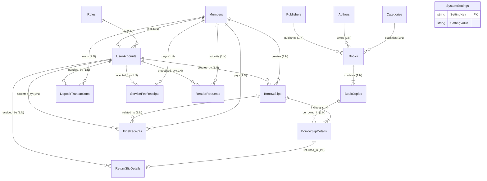

# THIẾT KẾ CƠ SỞ DỮ LIỆU HỆ THỐNG LIB_OPS

> **Dự án:** Xây Dựng Hệ Thống LibOps - Quản Lý Thư Viện  
> **Hệ quản trị CSDL (DBMS):** Microsoft SQL Server LocalDB (`(localdb)\MSSQLLocalDB`)  
> **Tên Cơ Sở Dữ Liệu:** `LibOpsDb`  
> **Quy mô CSDL:** Tổng cộng **16 bảng dữ liệu** chuẩn hóa (Chuẩn 3NF), có đầy đủ khóa chính (PK), khóa ngoại (FK), chỉ mục hiệu năng (Indexes) và ràng buộc toàn vẹn.

---

## MỤC LỤC
1. [Tổng Quan 16 Bảng Dữ Liệu Theo Nhóm Nghiệp Vụ](#1-tổng-quan-16-bảng-dữ-liệu-theo-nhóm-nghiệp-vụ)
2. [Sơ Đồ & Mối Quan Hệ Giữa Các Bảng (Entity Relationship)](#2-sơ-đồ--mối-quan-hệ-giữa-các-bảng-entity-relationship)
3. [Chi Tiết 16 Bảng Dữ Liệu](#3-chi-tiết-16-bảng-dữ-liệu)
   - [3.1. Bảng Roles (Vai Trò Người Dùng)](#31-bảng-roles-vai-trò-người-dùng)
   - [3.2. Bảng Members (Hồ Sơ Độc Giả & Thẻ Thư Viện)](#32-bảng-members-hồ-sơ-độc-giả--thẻ-thư-viện)
   - [3.3. Bảng UserAccounts (Tài Khoản Đăng Nhập Hệ Thống)](#33-bảng-useraccounts-tài-khoản-đăng-nhập-hệ-thống)
   - [3.4. Bảng Categories (Thể Loại Sách)](#34-bảng-categories-thể-loại-sách)
   - [3.5. Bảng Authors (Tác Giả)](#35-bảng-authors-tác-giả)
   - [3.6. Bảng Publishers (Nhà Xuất Bản)](#36-bảng-publishers-nhà-xuất-bản)
   - [3.7. Bảng Books (Đầu Sách / Tác Phẩm)](#37-bảng-books-đầu-sách--tác-phẩm)
   - [3.8. Bảng BookCopies (Bản Sao Cuốn Sách Cá Biệt)](#38-bảng-bookcopies-bản-sao-cuốn-sách-cá-biệt)
   - [3.9. Bảng BorrowSlips (Phiếu Mượn Sách)](#39-bảng-borrowslips-phiếu-mượn-sách)
   - [3.10. Bảng BorrowSlipDetails (Chi Tiết Cuốn Sách Mượn)](#310-bảng-borrowslipdetails-chi-tiết-cuốn-sách-mượn)
   - [3.11. Bảng ReturnSlipDetails (Chi Tiết Trả Sách & Phạt Trễ Hạn)](#311-bảng-returnslipdetails-chi-tiết-trả-sách--phạt-trễ-hạn)
   - [3.12. Bảng DepositTransactions (Sổ Cái Dòng Tiền Cọc Độc Giả)](#312-bảng-deposittransactions-sổ-cái-dòng-tiền-cọc-độc-giả)
   - [3.13. Bảng FineReceipts (Biên Lai Thu Tiền Phạt & Đền Bù)](#313-bảng-finereceipts-biên-lai-thu-tiền-phạt--đền-bù)
   - [3.14. Bảng ServiceFeeReceipts (Biên Lai Thu Phí Dịch Vụ)](#314-bảng-servicefeereceipts-biên-lai-thu-phí-dịch-vụ)
   - [3.15. Bảng ReaderRequests (Yêu Cầu Tự Phục Vụ Trực Tuyến)](#315-bảng-readerrequests-yêu-cầu-tự-phục-vụ-trực-tuyến)
   - [3.16. Bảng SystemSettings (Tham Số Nghiệp Vụ & Cấu Hình)](#316-bảng-systemsettings-tham-số-nghiệp-vụ--cấu-hình)
4. [Danh Sách Tham Số Cấu Hình Hệ Thống Mặc Định (SystemSettings)](#4-danh-sách-tham-số-cấu-hình-hệ-thống-mặc-định-systemsettings)

---

## 1. TỔNG QUAN 16 BẢNG DỮ LIỆU THEO NHÓM NGHIỆP VỤ

Hệ thống cơ sở dữ liệu gồm **16 bảng**, được chia thành 6 phân hệ chức năng:

- **Phân hệ 1: Xác thực & Phân quyền (2 bảng)**
  - `Roles`: Danh mục vai trò trong hệ thống (Admin, Thủ thư, Độc giả).
  - `UserAccounts`: Tài khoản người dùng đăng nhập hệ thống.

- **Phân hệ 2: Quản lý Danh mục & Kho Sách (5 bảng)**
  - `Categories`: Danh mục thể loại sách.
  - `Authors`: Thông tin tác giả.
  - `Publishers`: Thông tin nhà xuất bản.
  - `Books`: Danh mục đầu sách, giá bìa, vị trí kệ, tổng số lượng và số lượng khả dụng.
  - `BookCopies`: Quản lý từng cuốn sách vật lý cụ thể qua mã vạch Barcode độc nhất.

- **Phân hệ 3: Quản lý Hồ sơ Độc giả (1 bảng)**
  - `Members`: Hồ sơ độc giả, thông tin thẻ, số dư tiền cọc thế chân và nợ phạt.

- **Phân hệ 4: Nghiệp vụ Lưu thông Mượn - Trả Sách (3 bảng)**
  - `BorrowSlips`: Thông tin phiếu mượn sách, hạn trả và số lần gia hạn.
  - `BorrowSlipDetails`: Danh sách các cuốn sách cụ thể trong từng phiếu mượn.
  - `ReturnSlipDetails`: Ghi nhận trả sách, tính số ngày quá hạn, tiền phạt và tình trạng sách sau khi trả.

- **Phân hệ 5: Quản lý Dòng tiền & Tài chính Thư viện (3 bảng)**
  - `DepositTransactions`: Sổ cái ghi nhận mọi biến động nạp/hoàn/cấn trừ tiền cọc.
  - `FineReceipts`: Biên lai thu tiền phạt quá hạn, đền bù mất sách, đền bù hư hỏng.
  - `ServiceFeeReceipts`: Biên lai thu phí làm thẻ mới và phí gia hạn thường niên.

- **Phân hệ 6: Cổng Tự Phục Vụ & Cấu hình Hệ thống (2 bảng)**
  - `ReaderRequests`: Tiếp nhận và xét duyệt yêu cầu trực tuyến (hủy thẻ, cấp lại, cập nhật CCCD).
  - `SystemSettings`: Bảng lưu trữ linh hoạt các tham số nghiệp vụ toàn hệ thống (mức cọc, hạn mượn, email SMTP...).

---

## 2. SƠ ĐỒ & MỐI QUAN HỆ GIỮA CÁC BẢNG (ENTITY RELATIONSHIP)

### 2.1. Sơ đồ quan hệ ERD Diagram

### 2.2. Danh sách các liên kết khóa ngoại (Foreign Keys)
- `UserAccounts.RoleId` $\rightarrow$ `Roles(RoleId)`: Phân quyền tài khoản người dùng.
- `UserAccounts.MemberId` $\rightarrow$ `Members(MemberId)`: Liên kết tài khoản độc giả với hồ sơ thẻ.
- `Books.CategoryId` $\rightarrow$ `Categories(CategoryId)`: Gắn sách với thể loại.
- `Books.AuthorId` $\rightarrow$ `Authors(AuthorId)`: Gắn sách với tác giả.
- `Books.PublisherId` $\rightarrow$ `Publishers(PublisherId)`: Gắn sách với nhà xuất bản.
- `BookCopies.BookId` $\rightarrow$ `Books(BookId)`: Gắn bản sao cá biệt vào đầu sách (`ON DELETE CASCADE`).
- `BorrowSlips.MemberId` $\rightarrow$ `Members(MemberId)`: Phiếu mượn thuộc về độc giả.
- `BorrowSlips.CreatedByUserId` $\rightarrow$ `UserAccounts(UserId)`: Thủ thư thực hiện lập phiếu mượn.
- `BorrowSlipDetails.BorrowSlipId` $\rightarrow$ `BorrowSlips(BorrowSlipId)`: Chi tiết thuộc phiếu mượn (`ON DELETE CASCADE`).
- `BorrowSlipDetails.CopyId` $\rightarrow$ `BookCopies(CopyId)`: Chi tiết mượn gắn với bản sao sách cụ thể.
- `ReturnSlipDetails.BorrowSlipDetailId` $\rightarrow$ `BorrowSlipDetails(DetailId)`: Chi tiết trả ứng với chi tiết mượn.
- `ReturnSlipDetails.ReceivedByUserId` $\rightarrow$ `UserAccounts(UserId)`: Thủ thư tiếp nhận sách trả.
- `DepositTransactions.MemberId` $\rightarrow$ `Members(MemberId)`: Giao dịch tiền cọc của độc giả.
- `DepositTransactions.HandledByUserId` $\rightarrow$ `UserAccounts(UserId)`: Người xử lý giao dịch cọc.
- `FineReceipts.MemberId` $\rightarrow$ `Members(MemberId)`: Biên lai phạt của độc giả.
- `FineReceipts.BorrowSlipId` $\rightarrow$ `BorrowSlips(BorrowSlipId)`: Phiếu mượn phát sinh vi phạm.
- `FineReceipts.CollectedByUserId` $\rightarrow$ `UserAccounts(UserId)`: Thủ thư thu tiền phạt.
- `ServiceFeeReceipts.MemberId` $\rightarrow$ `Members(MemberId)`: Biên lai thu phí của độc giả.
- `ServiceFeeReceipts.CollectedByUserId` $\rightarrow$ `UserAccounts(UserId)`: Thủ thư thu phí dịch vụ.
- `ReaderRequests.MemberId` $\rightarrow$ `Members(MemberId)`: Yêu cầu của độc giả gửi lên.
- `ReaderRequests.ProcessedByUserId` $\rightarrow$ `UserAccounts(UserId)`: Thủ thư duyệt yêu cầu.

---

## 3. CHI TIẾT 16 BẢNG DỮ LIỆU

---

### 3.1. Bảng `Roles` (Vai Trò Người Dùng)
- **Dữ liệu lưu trữ:** Định nghĩa danh mục các nhóm quyền và vai trò người dùng trong hệ thống.
- **Khóa chính (PK):** `RoleId` (INT, Tự tăng `IDENTITY(1,1)`).
- **Khóa ngoại (FK):** Không có.
- **Ràng buộc:** Cột `RoleName` có ràng buộc Duy nhất (`UNIQUE`).
- **Danh sách các cột:**
  - `RoleId` (INT, Bắt buộc): Mã định danh vai trò (Khóa chính tự tăng).
  - `RoleName` (NVARCHAR(50), Bắt buộc, Unique): Tên mã vai trò. Giá trị Enum: `'ADMIN'` (Quản trị viên), `'LIBRARIAN'` (Thủ thư), `'READER'` (Độc giả).
  - `Description` (NVARCHAR(250), Tùy chọn `NULL`): Diễn giải chi tiết phạm vi quyền hạn của vai trò.

---

### 3.2. Bảng `Members` (Hồ Sơ Độc Giả & Thẻ Thư Viện)
- **Dữ liệu lưu trữ:** Lưu trữ hồ sơ thông tin độc giả, mã thẻ thư viện, số dư tiền cọc thế chân và tổng nợ phạt.
- **Khóa chính (PK):** `MemberId` (INT, Tự tăng `IDENTITY(1,1)`).
- **Khóa ngoại (FK):** Không có.
- **Chỉ mục (Index):** `IX_Members_MemberCardCode` (Unique), `IX_Members_PhoneNumber`, `IX_Members_IdentityCardNumber`.
- **Danh sách các cột:**
  - `MemberId` (INT, Bắt buộc): Mã định danh độc giả nội bộ (Khóa chính).
  - `MemberCardCode` (NVARCHAR(30), Bắt buộc, Unique): Mã số thẻ thư viện (VD: `DG20260001`).
  - `FullName` (NVARCHAR(100), Bắt buộc): Họ và tên đầy đủ của độc giả.
  - `PhoneNumber` (NVARCHAR(20), Bắt buộc): Số điện thoại liên hệ.
  - `Email` (NVARCHAR(100), Tùy chọn `NULL`): Địa chỉ email nhận thông báo tự động.
  - `IdentityCardNumber` (NVARCHAR(20), Tùy chọn `NULL`): Số CCCD / CMND.
  - `Address` (NVARCHAR(250), Tùy chọn `NULL`): Địa chỉ cư trú.
  - `DateOfBirth` (DATETIME, Tùy chọn `NULL`): Ngày tháng năm sinh.
  - `DepositBalance` (DECIMAL(18,2), Bắt buộc, Mặc định `0`): Số dư tiền cọc thế chân hiện tại (VNĐ).
  - `TotalDebt` (DECIMAL(18,2), Bắt buộc, Mặc định `0`): Tổng công nợ phạt chưa thanh toán (VNĐ).
  - `IssueDate` (DATETIME, Bắt buộc, Mặc định `GETDATE()`): Ngày cấp thẻ thư viện.
  - `ExpiryDate` (DATETIME, Bắt buộc): Ngày hết hạn hiệu lực của thẻ thư viện.
  - `CardStatus` (NVARCHAR(30), Bắt buộc, Mặc định `'ACTIVE'`): Trạng thái thẻ thư viện. Giá trị Enum:
    - `'ACTIVE'`: Thẻ đang hoạt động bình thường, đủ điều kiện mượn sách.
    - `'EXPIRED'`: Thẻ đã quá hạn hiệu lực (cần đóng phí gia hạn).
    - `'LOCKED'`: Thẻ bị tạm khóa do vi phạm hoặc mất thẻ.
    - `'CLOSED'`: Thẻ đã đóng, đã hoàn cọc và chấm dứt quyền lợi.
  - `Notes` (NVARCHAR(250), Tùy chọn `NULL`): Ghi chú thêm về độc giả.
  - `CreatedAt` (DATETIME, Bắt buộc, Mặc định `GETDATE()`): Thời điểm tạo hồ sơ.

---

### 3.3. Bảng `UserAccounts` (Tài Khoản Đăng Nhập Hệ Thống)
- **Dữ liệu lưu trữ:** Quản lý thông tin xác thực đăng nhập của Quản trị viên, Thủ thư và Độc giả.
- **Khóa chính (PK):** `UserId` (INT, Tự tăng `IDENTITY(1,1)`).
- **Khóa ngoại (FK):**
  - `RoleId` $\rightarrow$ `Roles(RoleId)`: Xác định vai trò đăng nhập.
  - `MemberId` $\rightarrow$ `Members(MemberId)` (Nullable): Liên kết 1-1 với hồ sơ độc giả (nếu là tài khoản Độc giả).
- **Ràng buộc:** Cột `Username` có ràng buộc Duy nhất (`UNIQUE`).
- **Danh sách các cột:**
  - `UserId` (INT, Bắt buộc): Mã định danh tài khoản người dùng (Khóa chính).
  - `Username` (NVARCHAR(50), Bắt buộc, Unique): Tên đăng nhập hệ thống (Mã thẻ đối với Độc giả).
  - `PasswordHash` (NVARCHAR(256), Bắt buộc): Mật khẩu đã băm bằng thuật toán bảo mật SHA-256.
  - `PasswordSalt` (NVARCHAR(128), Bắt buộc): Chuỗi muối (Salt) ngẫu nhiên 32-byte chống tấn công từ điển.
  - `FullName` (NVARCHAR(100), Bắt buộc): Họ tên người sử dụng tài khoản.
  - `Email` (NVARCHAR(100), Tùy chọn `NULL`): Email liên kết với tài khoản.
  - `PhoneNumber` (NVARCHAR(20), Tùy chọn `NULL`): Số điện thoại liên lạc.
  - `RoleId` (INT, Bắt buộc, FK): Mã vai trò người dùng (`1`: Admin, `2`: Librarian, `3`: Reader).
  - `MemberId` (INT, Tùy chọn `NULL`, FK): Mã độc giả liên kết (với Admin/Thủ thư trường này là `NULL`).
  - `IsActive` (BIT, Bắt buộc, Mặc định `1`): Trạng thái tài khoản (`1`: Hoạt động, `0`: Bị khóa).
  - `CreatedAt` (DATETIME, Bắt buộc, Mặc định `GETDATE()`): Thời điểm tạo tài khoản.

---

### 3.4. Bảng `Categories` (Thể Loại Sách)
- **Dữ liệu lưu trữ:** Danh mục phân loại các đầu sách theo chuyên môn và lĩnh vực.
- **Khóa chính (PK):** `CategoryId` (INT, Tự tăng `IDENTITY(1,1)`).
- **Khóa ngoại (FK):** Không có.
- **Ràng buộc:** Cột `CategoryName` có ràng buộc Duy nhất (`UNIQUE`).
- **Danh sách các cột:**
  - `CategoryId` (INT, Bắt buộc): Mã định danh thể loại (Khóa chính).
  - `CategoryName` (NVARCHAR(100), Bắt buộc, Unique): Tên thể loại sách (VD: *Công Nghệ Thông Tin, Kinh Tế...*).
  - `Description` (NVARCHAR(250), Tùy chọn `NULL`): Mô tả chi tiết thể loại.

---

### 3.5. Bảng `Authors` (Tác Giả)
- **Dữ liệu lưu trữ:** Quản lý thông tin và tiểu sử của các tác giả sách.
- **Khóa chính (PK):** `AuthorId` (INT, Tự tăng `IDENTITY(1,1)`).
- **Khóa ngoại (FK):** Không có.
- **Danh sách các cột:**
  - `AuthorId` (INT, Bắt buộc): Mã định danh tác giả (Khóa chính).
  - `AuthorName` (NVARCHAR(150), Bắt buộc): Tên đầy đủ của tác giả.
  - `Notes` (NVARCHAR(250), Tùy chọn `NULL`): Ghi chú, tóm tắt tiểu sử hoặc quốc tịch tác giả.

---

### 3.6. Bảng `Publishers` (Nhà Xuất Bản)
- **Dữ liệu lưu trữ:** Quản lý thông tin các nhà xuất bản phát hành sách.
- **Khóa chính (PK):** `PublisherId` (INT, Tự tăng `IDENTITY(1,1)`).
- **Khóa ngoại (FK):** Không có.
- **Ràng buộc:** Cột `PublisherName` có ràng buộc Duy nhất (`UNIQUE`).
- **Danh sách các cột:**
  - `PublisherId` (INT, Bắt buộc): Mã định danh nhà xuất bản (Khóa chính).
  - `PublisherName` (NVARCHAR(150), Bắt buộc, Unique): Tên nhà xuất bản (VD: *NXB Trẻ, NXB Kim Đồng...*).
  - `Address` (NVARCHAR(250), Tùy chọn `NULL`): Địa chỉ trụ sở nhà xuất bản.
  - `PhoneNumber` (NVARCHAR(20), Tùy chọn `NULL`): Số điện thoại liên hệ.

---

### 3.7. Bảng `Books` (Đầu Sách / Tác Phẩm)
- **Dữ liệu lưu trữ:** Lưu trữ thông tin tổng quát của từng đầu sách, giá bìa, vị trí kệ và số lượng tồn kho.
- **Khóa chính (PK):** `BookId` (INT, Tự tăng `IDENTITY(1,1)`).
- **Khóa ngoại (FK):**
  - `CategoryId` $\rightarrow$ `Categories(CategoryId)`: Mã thể loại.
  - `AuthorId` $\rightarrow$ `Authors(AuthorId)`: Mã tác giả.
  - `PublisherId` $\rightarrow$ `Publishers(PublisherId)`: Mã nhà xuất bản.
- **Danh sách các cột:**
  - `BookId` (INT, Bắt buộc): Mã định danh đầu sách (Khóa chính).
  - `ISBN` (NVARCHAR(30), Tùy chọn `NULL`): Mã số tiêu chuẩn quốc tế ISBN.
  - `Title` (NVARCHAR(250), Bắt buộc): Tựa đề cuốn sách.
  - `CategoryId` (INT, Bắt buộc, FK): Mã thể loại sách.
  - `AuthorId` (INT, Bắt buộc, FK): Mã tác giả chính sáng tác.
  - `PublisherId` (INT, Bắt buộc, FK): Mã nhà xuất bản phát hành.
  - `PublishYear` (INT, Tùy chọn `NULL`): Năm xuất bản.
  - `Price` (DECIMAL(18,2), Bắt buộc, Mặc định `0`): Giá bìa cuốn sách (dùng để tính tiền phạt đền bù khi mất/hỏng).
  - `ShelfLocation` (NVARCHAR(100), Tùy chọn `NULL`): Vị trí kệ sách trong kho (VD: `Kệ A-01`).
  - `CoverImagePath` (NVARCHAR(500), Tùy chọn `NULL`): Đường dẫn lưu trữ ảnh bìa sách.
  - `Summary` (NVARCHAR(MAX), Tùy chọn `NULL`): Tóm tắt nội dung giới thiệu sách.
  - `TotalQuantity` (INT, Bắt buộc, Mặc định `0`): Tổng số lượng bản sao vật lý thư viện sở hữu.
  - `AvailableQuantity` (INT, Bắt buộc, Mặc định `0`): Số lượng bản sao khả dụng sẵn sàng cho mượn tại chỗ/về nhà.

---

### 3.8. Bảng `BookCopies` (Bản Sao Cuốn Sách Cá Biệt)
- **Dữ liệu lưu trữ:** Quản lý từng cuốn sách vật lý cụ thể thông qua mã vạch Barcode độc nhất.
- **Khóa chính (PK):** `CopyId` (INT, Tự tăng `IDENTITY(1,1)`).
- **Khóa ngoại (FK):** `BookId` $\rightarrow$ `Books(BookId)` (`ON DELETE CASCADE`).
- **Chỉ mục (Index):** `IX_BookCopies_Barcode` (Unique), `IX_BookCopies_Status`.
- **Danh sách các cột:**
  - `CopyId` (INT, Bắt buộc): Mã định danh bản sao sách cá biệt (Khóa chính).
  - `BookId` (INT, Bắt buộc, FK): Mã đầu sách sở hữu cuốn sách này.
  - `Barcode` (NVARCHAR(50), Bắt buộc, Unique): Mã vạch cá biệt in trên cuốn sách (VD: `BC-CNTT-0001`).
  - `Status` (NVARCHAR(30), Bắt buộc, Mặc định `'AVAILABLE'`): Trạng thái bản sao sách. Giá trị Enum:
    - `'AVAILABLE'`: Sách đang có sẵn trên giá, sẵn sàng cho mượn.
    - `'BORROWED'`: Sách đang được độc giả mượn về nhà.
    - `'DAMAGED'`: Sách đang bị hư hại, chờ xử lý/sửa chữa.
    - `'LOST'`: Sách đã bị mất trong quá trình mượn.
  - `ConditionNote` (NVARCHAR(250), Tùy chọn `NULL`): Tình trạng sách khi nhập kho (VD: *Mới 100%, Bìa cũ nhẹ...*).
  - `AddedDate` (DATETIME, Bắt buộc, Mặc định `GETDATE()`): Ngày nhập bản sao vào kho.

---

### 3.9. Bảng `BorrowSlips` (Phiếu Mượn Sách)
- **Dữ liệu lưu trữ:** Quản lý thông tin từng đợt mượn sách của độc giả, ngày mượn, hạn trả và số lần gia hạn.
- **Khóa chính (PK):** `BorrowSlipId` (INT, Tự tăng `IDENTITY(1,1)`).
- **Khóa ngoại (FK):**
  - `MemberId` $\rightarrow$ `Members(MemberId)`: Mã độc giả mượn sách.
  - `CreatedByUserId` $\rightarrow$ `UserAccounts(UserId)`: Mã thủ thư lập phiếu mượn.
- **Chỉ mục (Index):** `IX_BorrowSlips_Status_DueDate`.
- **Danh sách các cột:**
  - `BorrowSlipId` (INT, Bắt buộc): Mã định danh phiếu mượn nội bộ (Khóa chính).
  - `SlipCode` (NVARCHAR(30), Bắt buộc, Unique): Mã phiếu mượn hiển thị (VD: `PM20260901-001`).
  - `MemberId` (INT, Bắt buộc, FK): Mã độc giả mượn sách.
  - `CreatedByUserId` (INT, Bắt buộc, FK): Mã thủ thư lập phiếu mượn.
  - `BorrowDate` (DATETIME, Bắt buộc, Mặc định `GETDATE()`): Ngày giờ thực hiện mượn sách.
  - `DueDate` (DATETIME, Bắt buộc): Hạn chót phải hoàn trả sách (chuẩn 14 ngày).
  - `RenewalCount` (INT, Bắt buộc, Mặc định `0`): Số lần đã gia hạn phiếu mượn (tối đa 1 lần).
  - `Status` (NVARCHAR(30), Bắt buộc, Mặc định `'BORROWING'`): Trạng thái phiếu mượn. Giá trị Enum:
    - `'BORROWING'`: Đang mượn (chưa trả hoặc còn sách chưa trả).
    - `'RETURNED'`: Đã hoàn trả đầy đủ tất cả sách trong phiếu.
    - `'OVERDUE'`: Đã quá hạn trả nhưng độc giả chưa hoàn trả sách.
  - `Notes` (NVARCHAR(250), Tùy chọn `NULL`): Ghi chú thêm về phiếu mượn.

---

### 3.10. Bảng `BorrowSlipDetails` (Chi Tiết Cuốn Sách Mượn)
- **Dữ liệu lưu trữ:** Danh sách chi tiết từng cuốn sách vật lý cá biệt nằm trong một phiếu mượn.
- **Khóa chính (PK):** `DetailId` (INT, Tự tăng `IDENTITY(1,1)`).
- **Khóa ngoại (FK):**
  - `BorrowSlipId` $\rightarrow$ `BorrowSlips(BorrowSlipId)` (`ON DELETE CASCADE`).
  - `CopyId` $\rightarrow$ `BookCopies(CopyId)`: Mã bản sao sách được mượn.
- **Danh sách các cột:**
  - `DetailId` (INT, Bắt buộc): Mã chi tiết mượn (Khóa chính).
  - `BorrowSlipId` (INT, Bắt buộc, FK): Mã phiếu mượn chứa dòng chi tiết này.
  - `CopyId` (INT, Bắt buộc, FK): Mã bản sao cuốn sách cụ thể.
  - `BorrowConditionNote` (NVARCHAR(250), Tùy chọn `NULL`): Tình trạng vật lý của cuốn sách tại thời điểm cho mượn.

---

### 3.11. Bảng `ReturnSlipDetails` (Chi Tiết Trả Sách & Phạt Trễ Hạn)
- **Dữ liệu lưu trữ:** Ghi nhận nghiệp vụ trả sách, kiểm tra trễ hạn, tính tiền phạt quá hạn và cập nhật tình trạng sách sau khi trả.
- **Khóa chính (PK):** `ReturnDetailId` (INT, Tự tăng `IDENTITY(1,1)`).
- **Khóa ngoại (FK):**
  - `BorrowSlipDetailId` $\rightarrow$ `BorrowSlipDetails(DetailId)`: Chi tiết dòng mượn được trả.
  - `ReceivedByUserId` $\rightarrow$ `UserAccounts(UserId)`: Thủ thư tiếp nhận sách.
- **Danh sách các cột:**
  - `ReturnDetailId` (INT, Bắt buộc): Mã chi tiết trả sách (Khóa chính).
  - `BorrowSlipDetailId` (INT, Bắt buộc, FK, Unique): Mã dòng chi tiết mượn tương ứng (Mỗi cuốn mượn trả 1 lần).
  - `ReceivedByUserId` (INT, Bắt buộc, FK): Mã thủ thư tiếp nhận sách trả tại quầy.
  - `ActualReturnDate` (DATETIME, Bắt buộc, Mặc định `GETDATE()`): Ngày giờ thực tế độc giả trả sách.
  - `OverdueDays` (INT, Bắt buộc, Mặc định `0`): Số ngày trả trễ quá hạn (bằng 0 nếu trả đúng hạn).
  - `FineAmount` (DECIMAL(18,2), Bắt buộc, Mặc định `0`): Số tiền phạt quá hạn phát sinh (5.000 VNĐ/ngày trễ).
  - `ReturnConditionNote` (NVARCHAR(250), Tùy chọn `NULL`): Đánh giá tình trạng sách khi trả (VD: *Nguyên vẹn, Rách bìa...*).
  - `BookCopyStatusAfterReturn` (NVARCHAR(30), Bắt buộc, Mặc định `'AVAILABLE'`): Trạng thái cập nhật lại cho cuốn sách (`'AVAILABLE'`, `'DAMAGED'`, `'LOST'`).

---

### 3.12. Bảng `DepositTransactions` (Sổ Cái Dòng Tiền Cọc Độc Giả)
- **Dữ liệu lưu trữ:** Ghi nhận lịch sử biến động dòng tiền cọc thế chân của độc giả phục vụ kiểm toán tài chính và đối soát.
- **Khóa chính (PK):** `TransactionId` (INT, Tự tăng `IDENTITY(1,1)`).
- **Khóa ngoại (FK):**
  - `MemberId` $\rightarrow$ `Members(MemberId)`: Mã độc giả.
  - `HandledByUserId` $\rightarrow$ `UserAccounts(UserId)`: Thủ thư/Hệ thống xử lý.
- **Chỉ mục (Index):** `IX_DepositTransactions_MemberId`.
- **Danh sách các cột:**
  - `TransactionId` (INT, Bắt buộc): Mã định danh giao dịch cọc (Khóa chính).
  - `MemberId` (INT, Bắt buộc, FK): Mã độc giả thực hiện giao dịch.
  - `HandledByUserId` (INT, Bắt buộc, FK): Mã thủ thư hoặc tài khoản hệ thống thực hiện ghi sổ.
  - `TransactionType` (NVARCHAR(30), Bắt buộc): Loại giao dịch dòng tiền. Giá trị Enum:
    - `'INITIAL_DEPOSIT'`: Nạp tiền cọc ký quỹ lần đầu khi mở thẻ (200.000 VNĐ).
    - `'TOPUP_DEPOSIT'`: Nạp thêm tiền cọc (qua tiền mặt tại quầy hoặc qua quét mã VietQR tự động).
    - `'REFUND_CLOSURE'`: Hoàn trả lại tiền cọc thừa khi độc giả hủy thẻ thư viện.
    - `'DEBT_DEDUCTION'`: Tự động cấn trừ tiền cọc để thanh toán nợ phạt quá hạn / đền bù sách.
  - `Amount` (DECIMAL(18,2), Bắt buộc): Số tiền biến động (VNĐ).
  - `BalanceAfter` (DECIMAL(18,2), Bắt buộc): Số dư tiền cọc sau khi giao dịch hoàn tất (VNĐ).
  - `ReceiptCode` (NVARCHAR(30), Tùy chọn `NULL`): Mã số biên lai thu hoặc phiếu chi liên quan.
  - `TransactionDate` (DATETIME, Bắt buộc, Mặc định `GETDATE()`): Thời điểm ghi nhận giao dịch.
  - `Notes` (NVARCHAR(250), Tùy chọn `NULL`): Diễn giải chi tiết nội dung giao dịch.

---

### 3.13. Bảng `FineReceipts` (Biên Lai Thu Tiền Phạt & Đền Bù)
- **Dữ liệu lưu trữ:** Lưu trữ các khoản thu tiền phạt quá hạn, đền bù mất sách hoặc đền bù hư hỏng sách.
- **Khóa chính (PK):** `ReceiptId` (INT, Tự tăng `IDENTITY(1,1)`).
- **Khóa ngoại (FK):**
  - `MemberId` $\rightarrow$ `Members(MemberId)`: Mã độc giả nộp phạt.
  - `BorrowSlipId` $\rightarrow$ `BorrowSlips(BorrowSlipId)` (Nullable): Mã phiếu mượn liên quan.
  - `CollectedByUserId` $\rightarrow$ `UserAccounts(UserId)`: Mã thủ thư thu tiền phạt.
- **Danh sách các cột:**
  - `ReceiptId` (INT, Bắt buộc): Mã định danh biên lai thu phạt (Khóa chính).
  - `ReceiptCode` (NVARCHAR(30), Bắt buộc, Unique): Mã số biên lai hiển thị (VD: `REC-FINE-20260901-001`).
  - `MemberId` (INT, Bắt buộc, FK): Mã độc giả nộp phạt.
  - `BorrowSlipId` (INT, Tùy chọn `NULL`, FK): Mã phiếu mượn phát sinh vi phạm.
  - `CollectedByUserId` (INT, Bắt buộc, FK): Mã thủ thư lập biên lai thu phạt.
  - `TotalAmount` (DECIMAL(18,2), Bắt buộc): Tổng số tiền phạt thực thu (VNĐ).
  - `PaymentMethod` (NVARCHAR(30), Bắt buộc, Mặc định `'DEPOSIT_DEDUCTION'`): Phương thức thanh toán. Giá trị Enum:
    - `'CASH'`: Nộp tiền mặt tại quầy.
    - `'BANK_TRANSFER'`: Chuyển khoản qua quét mã VietQR.
    - `'DEPOSIT_DEDUCTION'`: Cấn trừ trực tiếp vào số dư tiền cọc thế chân của độc giả.
  - `Reason` (NVARCHAR(250), Bắt buộc): Lý do thu tiền (Phạt trả trễ hạn, Đền bù mất sách 200%, Đền bù hỏng sách 50%).
  - `PaymentDate` (DATETIME, Bắt buộc, Mặc định `GETDATE()`): Ngày giờ thu tiền.
  - `Notes` (NVARCHAR(250), Tùy chọn `NULL`): Ghi chú thêm.

---

### 3.14. Bảng `ServiceFeeReceipts` (Biên Lai Thu Phí Dịch Vụ)
- **Dữ liệu lưu trữ:** Quản lý doanh thu từ các dịch vụ thư viện không hoàn lại (Phí phát hành thẻ, Phí gia hạn thường niên).
- **Khóa chính (PK):** `ReceiptId` (INT, Tự tăng `IDENTITY(1,1)`).
- **Khóa ngoại (FK):**
  - `MemberId` $\rightarrow$ `Members(MemberId)`: Mã độc giả nộp phí.
  - `CollectedByUserId` $\rightarrow$ `UserAccounts(UserId)`: Mã thủ thư thu phí.
- **Chỉ mục (Index):** `IX_ServiceFeeReceipts_MemberId`.
- **Danh sách các cột:**
  - `ReceiptId` (INT, Bắt buộc): Mã định danh biên lai phí dịch vụ (Khóa chính).
  - `ReceiptCode` (NVARCHAR(30), Bắt buộc, Unique): Mã số biên lai thu phí (VD: `REC-FEE-20260901-001`).
  - `MemberId` (INT, Bắt buộc, FK): Mã độc giả nộp phí.
  - `FeeType` (NVARCHAR(30), Bắt buộc): Loại phí dịch vụ. Giá trị Enum:
    - `'CARD_ISSUANCE_FEE'`: Phí phát hành thẻ mới lần đầu (50.000 VNĐ).
    - `'ANNUAL_RENEWAL_FEE'`: Phí thường niên khi gia hạn thẻ (50.000 VNĐ/năm).
  - `Amount` (DECIMAL(18,2), Bắt buộc): Số tiền thu phí dịch vụ (VNĐ).
  - `PaymentMethod` (NVARCHAR(30), Bắt buộc, Mặc định `'CASH'`): Phương thức thanh toán (`'CASH'`, `'BANK_TRANSFER'`).
  - `PaymentDate` (DATETIME, Bắt buộc, Mặc định `GETDATE()`): Ngày giờ thu phí.
  - `CollectedByUserId` (INT, Bắt buộc, FK): Mã thủ thư thực hiện thu phí.
  - `Notes` (NVARCHAR(250), Tùy chọn `NULL`): Ghi chú thêm.

---

### 3.15. Bảng `ReaderRequests` (Yêu Cầu Tự Phục Vụ Trực Tuyến)
- **Dữ liệu lưu trữ:** Tiếp nhận và theo dõi tiến trình xử lý các yêu cầu trực tuyến do độc giả gửi từ cổng OPAC.
- **Khóa chính (PK):** `RequestId` (INT, Tự tăng `IDENTITY(1,1)`).
- **Khóa ngoại (FK):**
  - `MemberId` $\rightarrow$ `Members(MemberId)`: Độc giả gửi yêu cầu.
  - `ProcessedByUserId` $\rightarrow$ `UserAccounts(UserId)` (Nullable): Thủ thư xét duyệt.
- **Chỉ mục (Index):** `IX_ReaderRequests_MemberId`.
- **Danh sách các cột:**
  - `RequestId` (INT, Bắt buộc): Mã định danh yêu cầu nội bộ (Khóa chính).
  - `RequestCode` (NVARCHAR(30), Bắt buộc, Unique): Mã yêu cầu hiển thị (VD: `REQ20260901-001`).
  - `MemberId` (INT, Bắt buộc, FK): Mã độc giả gửi yêu cầu.
  - `RequestType` (NVARCHAR(30), Bắt buộc): Phân loại yêu cầu. Giá trị Enum:
    - `'CANCEL_CARD'`: Yêu cầu hủy thẻ thư viện và xin hoàn trả tiền cọc thừa.
    - `'REISSUE_CARD'`: Yêu cầu cấp lại thẻ thư viện do bị mất/hỏng thẻ.
    - `'UPDATE_INFO'`: Yêu cầu cập nhật thông tin cá nhân hoặc số CCCD.
  - `Status` (NVARCHAR(30), Bắt buộc, Mặc định `'PENDING'`): Trạng thái xử lý. Giá trị Enum:
    - `'PENDING'`: Chờ thủ thư tiếp nhận và xét duyệt.
    - `'APPROVED'`: Thủ thư đã chấp thuận và hoàn tất xử lý.
    - `'REJECTED'`: Thủ thư từ chối yêu cầu (kèm lý do).
  - `Amount` (DECIMAL(18,2), Bắt buộc, Mặc định `0`): Số tiền hoàn cọc (nếu là yêu cầu hủy thẻ - VNĐ).
  - `PayoutMethod` (NVARCHAR(30), Bắt buộc, Mặc định `'BANK_TRANSFER'`): Hình thức nhận tiền hoàn (`'CASH'`, `'BANK_TRANSFER'`).
  - `BankName` (NVARCHAR(100), Tùy chọn `NULL`): Tên ngân hàng nhận tiền hoàn cọc.
  - `BankAccountNumber` (NVARCHAR(50), Tùy chọn `NULL`): Số tài khoản ngân hàng nhận tiền hoàn.
  - `BankAccountHolder` (NVARCHAR(100), Tùy chọn `NULL`): Tên chủ tài khoản ngân hàng.
  - `Reason` (NVARCHAR(250), Tùy chọn `NULL`): Lý do độc giả gửi yêu cầu.
  - `RequestDate` (DATETIME, Bắt buộc, Mặc định `GETDATE()`): Ngày giờ độc giả gửi yêu cầu.
  - `ProcessedByUserId` (INT, Tùy chọn `NULL`, FK): Mã thủ thư xét duyệt yêu cầu.
  - `ProcessedDate` (DATETIME, Tùy chọn `NULL`): Ngày giờ hoàn tất xét duyệt.
  - `StaffNotes` (NVARCHAR(250), Tùy chọn `NULL`): Phản hồi hoặc ghi chú của thủ thư gửi lại cho độc giả.

---

### 3.16. Bảng `SystemSettings` (Tham Số Nghiệp Vụ & Cấu Hình)
- **Dữ liệu lưu trữ:** Lưu trữ linh hoạt các tham số nghiệp vụ, mức cọc, tỷ lệ phạt, thông số Email SMTP và cổng thanh toán để có thể tùy biến trực tiếp mà không cần sửa code.
- **Khóa chính (PK):** `SettingKey` (NVARCHAR(50)).
- **Khóa ngoại (FK):** Không có.
- **Danh sách các cột:**
  - `SettingKey` (NVARCHAR(50), Bắt buộc, Khóa chính): Khóa định danh cấu hình (VD: `MAX_BORROW_DAYS`).
  - `SettingValue` (NVARCHAR(250), Bắt buộc): Giá trị cấu hình tương ứng.
  - `Description` (NVARCHAR(250), Tùy chọn `NULL`): Diễn giải ý nghĩa nghiệp vụ và đơn vị tính của tham số.
  - `LastModifiedAt` (DATETIME, Bắt buộc, Mặc định `GETDATE()`): Thời điểm cập nhật tham số gần nhất.

---

## 4. DANH SÁCH THAM SỐ CẤU HÌNH HỆ THỐNG MẶC ĐỊNH (SYSTEMSETTINGS)

Toàn bộ các tham số nghiệp vụ được khởi tạo sẵn trong CSDL gồm:

- **`CARD_ISSUANCE_FEE` (Giá trị: `50000` VNĐ):** Phí dịch vụ phát hành thẻ mới lần đầu (thu 1 lần, không hoàn lại).
- **`MEMBER_CARD_DEFAULT_DEPOSIT` (Giá trị: `200000` VNĐ):** Mức tiền cọc thế chân tối thiểu để độc giả được phép mượn sách về nhà.
- **`MEMBER_CARD_ANNUAL_FEE` (Giá trị: `50000` VNĐ):** Phí thường niên khi gia hạn thẻ độc giả (thu hàng năm).
- **`MEMBER_CARD_VALIDITY_DAYS` (Giá trị: `365` Ngày):** Thời hạn hiệu lực của thẻ độc giả kể từ ngày cấp.
- **`MAX_BOOKS_PER_MEMBER` (Giá trị: `5` Cuốn):** Số lượng sách tối đa một độc giả được phép mượn đồng thời.
- **`MAX_BORROW_DAYS` (Giá trị: `14` Ngày):** Thời hạn tối đa cho một lượt mượn sách.
- **`MAX_RENEWAL_COUNT` (Giá trị: `1` Lần):** Số lần gia hạn tối đa cho một phiếu mượn.
- **`RENEWAL_DAYS` (Giá trị: `7` Ngày):** Số ngày được gia hạn thêm cho mỗi lần gia hạn.
- **`FINE_PER_OVERDUE_DAY` (Giá trị: `5000` VNĐ/ngày/cuốn):** Mức tiền phạt cho mỗi ngày trả sách trễ hạn.
- **`LOST_BOOK_FINE_RATE` (Giá trị: `2.0` - Hệ số 200%):** Tỷ lệ đền bù khi làm mất sách (tính bằng 200% giá bìa sách).
- **`DAMAGED_BOOK_FINE_RATE` (Giá trị: `0.5` - Hệ số 50%):** Tỷ lệ đền bù khi làm hư hại sách (tính bằng 50% giá bìa sách).
- **`SYSTEM_EMAIL_NOTIFICATION_ENABLED` (Giá trị: `true`):** Công tắc bật/tắt tính năng tự động gửi email thông báo mượn/trả toàn hệ thống.
- **`SMTP_HOST` (Giá trị: `smtp.gmail.com`):** Máy chủ SMTP gửi email thông báo.
- **`SMTP_PORT` (Giá trị: `587`):** Cổng kết nối SMTP (chuẩn TLS/STARTTLS 587).
- **`SMTP_ENABLE_SSL` (Giá trị: `true`):** Bật mã hóa kết nối an toàn SSL/TLS.
- **`SMTP_USERNAME` (Giá trị: `dung2k5k58lx@gmail.com`):** Tài khoản email hệ thống gửi thư.
- **`SMTP_PASSWORD` (Giá trị: `citz voms bvei wuur`):** Mật khẩu ứng dụng (App Password) của hòm thư hệ thống.
- **`SMTP_FROM_NAME` (Giá trị: `LibOps - Thư Viện Hiện Đại`):** Tên hiển thị người gửi trong hòm thư của độc giả.
