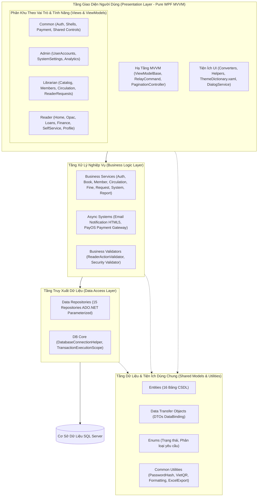
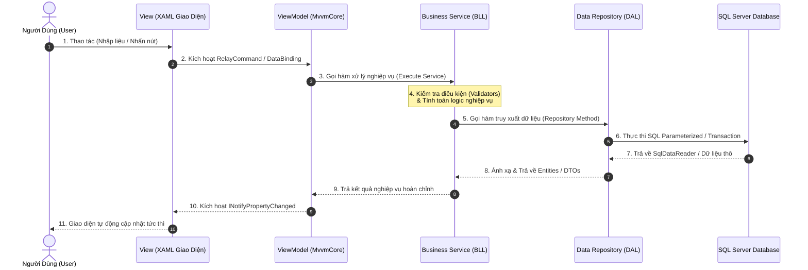

# KIẾN TRÚC HỆ THỐNG VÀ TỔ CHỨC DỰ ÁN (LIB_OPS SYSTEM ARCHITECTURE)

> **Tài liệu chuẩn hóa kiến trúc hệ thống:** Phiên bản 2.5 - Pure WPF & MVVM 3-Tier Architecture  
> **Cơ chế phân cấp:** Role-Based & Feature-Based Modularization  
> **Tiêu chuẩn đặt tên:** PascalCase, Hậu tố tường minh (Explicit Suffix), Tối ưu độ dài (Concise & Readable)

---

## 1. TỔNG QUAN MÔ HÌNH KIẾN TRÚC (3-TIER MVVM ARCHITECTURE)

### 1.1. Bản Chất Mô Hình Kiến Trúc 3 Tầng Kết Hợp Chuẩn MVVM Là Gì?

Hệ thống **LibOps (Library Operations Management System)** là sự kết hợp chặt chẽ giữa hai mẫu kiến trúc chuẩn mực trong kỹ nghệ phần mềm:
1. **Mô hình Kiến trúc 3 Tầng (3-Tier Architecture):** Phân chia toàn bộ hệ thống theo **chiều dọc** thành 3 tầng độc lập:
   - **Tầng Giao diện (Presentation Layer):** Chịu trách nhiệm hiển thị và tương tác với người dùng.
   - **Tầng Xử lý Nghiệp vụ (Business Logic Layer - BLL):** Chịu trách nhiệm thực thi toàn bộ quy tắc, tính toán và ràng buộc nghiệp vụ.
   - **Tầng Truy xuất Dữ liệu (Data Access Layer - DAL):** Chịu trách nhiệm giao tiếp, truy vấn và ghi dữ liệu trực tiếp vào Cơ sở dữ liệu SQL Server.
2. **Mẫu thiết kế MVVM (Model - View - ViewModel):** Được áp dụng **nội bộ bên trong Tầng Giao diện (Presentation Layer)** để loại bỏ hoàn toàn sự phụ thuộc (Tight Coupling) giữa giao diện XAML và mã xử lý C#, thay thế cơ chế code-behind truyền thống bằng cơ chế **DataBinding 2 chiều** và **ICommand**.

---

### 1.2. Sơ Đồ Phân Tầng Hệ Thống (Architecture Diagram)



---

### 1.3. Cấu Trúc Chi Tiết & Trách Nhiệm Từng Thành Phần

#### 1. View (`*.xaml` & `*.xaml.cs`) - Tầng Giao Diện (Presentation Layer)
* **Trách nhiệm:** Định nghĩa toàn bộ bố cục hiển thị, Controls, màu sắc, hiệu ứng hoạt họa và nhận các tương tác từ người dùng. View kết nối trực tiếp với ViewModel thông qua cơ chế DataBinding hai chiều và lắng nghe các lệnh thao tác (`ICommand`).
* **Quy tắc ràng buộc:** Tuyệt đối không viết câu lệnh truy vấn SQL, không gọi trực tiếp xuống DAL hay Database. Không xử lý logic nghiệp vụ bên trong file code-behind (`.xaml.cs`).

#### 2. ViewModel (`*ViewModel.cs`) - Tầng Giao Diện (Presentation Layer)
* **Trách nhiệm:** Đóng vai trò là "Bộ não điều khiển giao diện". Kế thừa `ViewModelBase` (`INotifyPropertyChanged`), đóng gói toàn bộ trạng thái dữ liệu (Properties), thực thi các lệnh người dùng qua `RelayCommand`, gọi xuống `BusinessLogicLayer` để xử lý nghiệp vụ và tự động thông báo cập nhật giao diện khi dữ liệu thay đổi.
* **Quy tắc ràng buộc:** Không tham chiếu trực tiếp đến các Control của WPF (như `Button`, `TextBox`, `DataGrid`...) để đảm bảo ViewModel hoàn toàn độc lập với UI framework và có thể viết Unit Test tự động.

#### 3. Business Service (`*Service.cs`) & Validator - Tầng Xử Lý Nghiệp Vụ (Business Logic Layer)
* **Trách nhiệm:** Thực thi toàn bộ quy tắc nghiệp vụ của thư viện: kiểm tra tư cách độc giả (`Validators`), tính toán tự động số ngày trễ hạn, tiền phạt hư hỏng/mất sách, cơ chế nạp cọc thác nước cấn trừ nợ xấu, băm mật khẩu bảo mật SHA-256 + Salt, phân quyền RBAC và quản lý giao dịch nghiệp vụ nhiều bước.
* **Quy tắc ràng buộc:** Độc lập 100% với giao diện người dùng, không phụ thuộc vào bất kỳ thư viện UI nào (WPF/WinForms) để có thể tái sử dụng trên CLI, Web API hoặc chạy kiểm thử tự động.

#### 4. Data Repository (`*Repository.cs`) - Tầng Truy Xuất Dữ Liệu (Data Access Layer)
* **Trách nhiệm:** Thực hiện các thao tác CRUD (Create, Read, Update, Delete) trực tiếp với SQL Server Database thông qua ADO.NET thuần. Sử dụng 100% Parameterized Query (`SqlParameter`) và mở kết nối an toàn với `using (var conn = ...)` hoặc nằm trong `TransactionExecutionScope`. Ánh xạ dữ liệu thô từ `SqlDataReader` sang các đối tượng `Entity` hoặc `DTO`.
* **Quy tắc ràng buộc:** Không chứa logic kiểm tra quy tắc nghiệp vụ; chỉ tập trung vào việc đọc/ghi dữ liệu an toàn, tối ưu hiệu năng truy vấn và ngăn ngừa triệt để lỗ hổng bảo mật SQL Injection.

#### 5. Data Models, Entities & DTOs - Tầng Dữ Liệu Dùng Chung (Shared Common Layers)
* **Trách nhiệm:**
  * **Entities (`*Entity.cs`):** Ánh xạ 1:1 với 16 bảng trong CSDL SQL Server.
  * **DTOs (`*Dto.cs`):** Gom nhóm dữ liệu hiển thị tối ưu cho DataBinding trên DataGrid, Card và biểu đồ thống kê.
  * **Enums:** Định nghĩa các tập giá trị trạng thái chuẩn toàn hệ thống (yêu cầu bạn đọc, tình trạng sách, trạng thái thẻ).
* **Quy tắc ràng buộc:** Là các đối tượng truyền tải dữ liệu thuần túy (POCO - Plain Old CLR Objects), không chứa logic nghiệp vụ hay truy vấn CSDL.

---

### 1.4. Luồng Hoạt Động Cụ Thể (Flow of Execution & Data Flow)

Hệ thống hoạt động theo nguyên tắc **Đơn Hướng Nghiệp Vụ (Unidirectional Call Flow)** và **Phản Hồi Hai Chiều (Bi-directional Data Binding)**:

1. **Bước 1 (User Interaction):** Người dùng thao tác trên giao diện (ví dụ: nhấn nút *Xác nhận mượn sách*, *Nạp tiền cọc*, hoặc nhập từ khóa tìm kiếm).
2. **Bước 2 (View $\rightarrow$ ViewModel):** `View (XAML)` tự động truyền dữ liệu vào các thuộc tính của `ViewModel` và kích hoạt lệnh `RelayCommand` tương ứng qua cơ chế Binding.
3. **Bước 3 (ViewModel $\rightarrow$ Business Service):** `ViewModel` gọi hàm xử lý nghiệp vụ tương ứng trên `BusinessService` (thuộc BLL) kèm theo các tham số cần thiết.
4. **Bước 4 (Business Logic Validation):** `BusinessService` kích hoạt `Validator` để kiểm tra điều kiện (ví dụ: thẻ còn hạn không, có nợ phạt không, số dư có đủ không). Nếu vi phạm, trả về lỗi ngay lập tức.
5. **Bước 5 (Business Service $\rightarrow$ Data Repository):** Khi điều kiện hợp lệ, `BusinessService` gọi xuống `DataRepository` (thuộc DAL) để thực hiện đọc/ghi dữ liệu.
6. **Bước 6 (Data Repository $\rightarrow$ SQL Server Database):** `DataRepository` mở kết nối an toàn (hoặc nằm trong `TransactionExecutionScope`), thực thi câu lệnh SQL Parameterized tới **SQL Server**, nhận kết quả và ánh xạ thành danh sách `Entities` hoặc `DTOs`.
7. **Bước 7 (DAL $\rightarrow$ BLL):** `DataRepository` trả đối tượng `Entity`/`DTO`/kết quả `bool` ngược về cho `BusinessService`.
8. **Bước 8 (BLL $\rightarrow$ ViewModel):** `BusinessService` hoàn tất các tác vụ bổ trợ (như sinh email thông báo ngầm, ghi log) và trả kết quả nghiệp vụ về cho `ViewModel`.
9. **Bước 9 (ViewModel $\rightarrow$ View Update):** `ViewModel` cập nhật lại các thuộc tính dữ liệu và gọi `OnPropertyChanged()` hoặc hiển thị thông báo qua `IDialogService`. `View` tự động cập nhật lại giao diện tức thì cho người dùng thấy kết quả mới nhất.



---

## 2. QUY TẮC ĐẶT TÊN FILE CHUẨN MỰC (NAMING CONVENTIONS)

Để mã nguồn vừa **dễ nhận diện vai trò/chức năng**, vừa **gọn gàng, chuyên nghiệp, không dài dòng**, toàn bộ các tệp trong dự án tuân thủ bộ quy tắc sau:

| Thành phần (Component) | Hậu tố chuẩn (Suffix) | Ý nghĩa & Cách dùng | Ví dụ điển hình |
| :--- | :--- | :--- | :--- |
| **Màn hình chính / Trang nội dung** | `*View.xaml` & `.cs` | Dành cho các màn hình `UserControl` hiển thị tại vùng làm việc chính (`ContentControl`) | `BookListView.xaml`, `LoginView.xaml`, `ReaderOpacView.xaml` |
| **Cửa sổ Hộp thoại / Popup Modal** | `*Dialog.xaml` & `.cs` | Dành cho các cửa sổ `Window` bật lên độc lập để thêm/sửa, xác nhận, chi tiết (Thay thế hậu tố `DialogWindow` quá dài) | `BookAddEditDialog.xaml`, `ChangePasswordDialog.xaml`, `MemberDepositDialog.xaml` |
| **Điều khiển giao diện tái sử dụng** | `*Control.xaml` & `.cs` | Các UserControl nhỏ nhúng vào nhiều nơi | `PaginationControl.xaml` |
| **Mô hình Điều khiển Giao diện** | `*ViewModel.cs` | Lớp quản lý trạng thái, Command và DataBinding (Tên khớp 1:1 với View/Dialog) | `BookListViewModel.cs`, `BookAddEditViewModel.cs`, `MemberDepositViewModel.cs` |
| **Dịch vụ Nghiệp vụ** | `*Service.cs` | Lớp xử lý nghiệp vụ tại BLL (Gọn gàng thay vì `*BusinessService.cs`) | `BookService.cs`, `MemberService.cs`, `BorrowReturnService.cs` |
| **Kiểm tra Ràng buộc Nghiệp vụ** | `*Validator.cs` | Lớp kiểm tra điều kiện nghiệp vụ logic | `ReaderActionValidator.cs` |
| **Kho Truy xuất Dữ liệu** | `*Repository.cs` | Lớp tương tác ADO.NET với từng bảng CSDL (Gọn gàng thay vì `*DataRepository.cs`) | `BookRepository.cs`, `MemberRepository.cs`, `BorrowSlipRepository.cs` |
| **Thực thể CSDL** | `*Entity.cs` | Đối tượng ánh xạ 1:1 với bảng trong SQL Server | `BookEntity.cs`, `MemberEntity.cs`, `BorrowSlipEntity.cs` |
| **Đối tượng Truyền tải Dữ liệu** | `*Dto.cs` | Dữ liệu gom nhóm phục vụ DataBinding hiển thị | `BookDisplayDto.cs`, `UserSessionDto.cs`, `RevenueReportDto.cs` |
| **Bộ chuyển đổi XAML** | `*Converter.cs` | Chuyển đổi dữ liệu hiển thị trên XAML | `CoverImageConverter.cs`, `BoolToStatusConverter.cs` |
| **Tiện ích Bổ trợ UI** | `*Helper.cs` | Lớp bổ trợ thuộc tính mở rộng (Attached Property) | `PasswordBoxHelper.cs`, `DatabaseConnectionHelper.cs` |
| **Tiện ích Xử lý Chung** | `*Utility.cs` | Thư viện hàm tĩnh thuần C# | `PasswordHashUtility.cs`, `VietQRUtility.cs`, `ExcelExportUtility.cs` |

---

## 3. CẤU TRÚC THƯ MỤC DỰ ÁN CHI TIẾT (PROJECT DIRECTORY TREE)

```text
LibOps/
│
├── PresentationLayer/                           <-- TẦNG GIAO DIỆN NGƯỜI DÙNG (PURE WPF MVVM)
│   ├── App.xaml & App.xaml.cs                   # Điểm khởi chạy ứng dụng (CLI verification, DB Init, Login Shell)
│   │
│   ├── MvvmCore/                                # Hạ tầng cốt lõi MVVM thuần túy
│   │   ├── ViewModelBase.cs                     # Lớp cơ sở triển khai INotifyPropertyChanged & IDialogService
│   │   ├── RelayCommand.cs                      # Hiện thực ICommand hỗ trợ Action & Predicate
│   │   └── PaginationController.cs              # Bộ điều khiển phân trang generic In-Memory
│   │
│   ├── Controls/                                # UserControl điều khiển giao diện dùng chung
│   │   ├── PaginationControl.xaml & .cs         # Giao diện thanh phân trang chuẩn (Page Size & 4 nút điều hướng)
│   │
│   ├── Converters/                              # Value Converters chuyển đổi dữ liệu hiển thị trên XAML
│   │   ├── StringToVisibilityConverter.cs       # Chuyển chuỗi null/rỗng sang Visibility
│   │   ├── BoolToStatusConverter.cs             # Chuyển Boolean sang Status text, Brush và Background
│   │   ├── CoverImageConverter.cs               # Chuyển đường dẫn ảnh bìa cục bộ sang BitmapImage an toàn
│   │   └── CurrencyFormatConverter.cs           # Định dạng tiền tệ VNĐ trên giao diện
│   │
│   ├── Helpers/                                 # Lớp bổ trợ giao diện (Attached Properties)
│   │   └── PasswordBoxHelper.cs                 # Hỗ trợ Placeholder mờ và nút Toggle Show/Hide mật khẩu
│   │
│   ├── Services/                                # Dịch vụ trừu tượng hóa UI & Dialogs cho MVVM
│   │   ├── IDialogService.cs                    # Giao diện trừu tượng hóa MessageBox & Dialog Windows
│   │   ├── WpfDialogService.cs                  # Hiện thực IDialogService trên môi trường WPF
│   │   └── DialogService.cs                     # Provider cung cấp thể hiện DialogService.Current mặc định
│   │
│   ├── Styles/                                  # Từ điển tài nguyên, Style & Bảng màu toàn ứng dụng
│   │   └── ThemeDictionary.xaml                 # Bảng màu Indigo Modern, Implicit Styles (TextBox, ComboBox, DataGrid, DatePicker), ModernCard, Buttons
│   │
│   ├── Views/                                              <-- CÁC MÀN HÌNH XAML GIAO DIỆN (PHÂN CẤP ROLE -> FEATURE)
│   │   │
│   │   ├── Common/                                         # Màn hình & Hộp thoại dùng chung toàn hệ thống
│   │   │   ├── Auth/                                       # Xác thực & An toàn tài khoản
│   │   │   │   ├── LoginView.xaml & .cs                    # Màn hình đăng nhập hệ thống
│   │   │   │   └── ChangePasswordDialog.xaml & .cs         # Hộp thoại đổi mật khẩu
│   │   │   ├── Shells/                                     # Khung điều hướng chính (Shell Navigation & KPI Tổng quan)
│   │   │   │   ├── MainDashboardView.xaml & .cs            # Khung làm việc chính cho Admin & Librarian (Sidebar + Topbar + Content)
│   │   │   │   ├── ReaderDashboardView.xaml & .cs          # Shell cổng tự phục vụ cho Độc giả
│   │   │   │   └── DashboardOverviewView.xaml & .cs        # Màn hình tổng quan KPI, Biểu đồ mượn trả & Top 5 sách
│   │   │   └── Payment/                                    # Hộp thoại thanh toán trực tuyến
│   │   │       └── VietQRQuickPayDialog.xaml & .cs         # Popup quét mã VietQR động
│   │   │
│   │   ├── Admin/                                          # Phân hệ dành riêng cho Quản trị viên (Admin)
│   │   │   ├── StaffAccounts/                              # Quản lý tài khoản & phân quyền nhân viên
│   │   │   │   ├── StaffManagementView.xaml & .cs          # Danh sách tài khoản người dùng, nhân viên & phân quyền
│   │   │   │   └── StaffDetailDialog.xaml & .cs            # Hộp thoại thêm mới / chỉnh sửa tài khoản nhân viên
│   │   │   ├── SystemSettings/                             # Thiết lập tham số quy định hệ thống động
│   │   │   │   └── SystemSettingsView.xaml & .cs           # Màn hình cấu hình hạn mức, tiền cọc, phí phạt, hạn thẻ
│   │   │   └── Analytics/                                  # Báo cáo phân tích nâng cao cho Admin
│   │   │       └── ReportAnalyticsView.xaml & .cs          # Báo cáo doanh thu tài chính, biến động cọc, xuất Excel (.xlsx)
│   │   │
│   │   ├── Librarian/                                      # Phân hệ nghiệp vụ của Thủ thư & Vận hành
│   │   │   ├── Catalog/                                    # Quản lý kho sách và danh mục nền tảng
│   │   │   │   ├── Books/                                  # Quản lý đầu sách và bản sao cá biệt
│   │   │   │   │   ├── BookListView.xaml & .cs             # Danh sách đầu sách, tìm kiếm, lọc thể loại
│   │   │   │   │   ├── BookDetailDialog.xaml & .cs         # Hộp thoại xem chi tiết thông tin sách & ảnh bìa
│   │   │   │   │   ├── BookAddEditDialog.xaml & .cs        # Hộp thoại thêm mới / chỉnh sửa sách
│   │   │   │   │   ├── QuickAddMetadataDialog.xaml & .cs   # Hộp thoại thêm nhanh Thể loại, Tác giả, Nhà xuất bản
│   │   │   │   │   └── BookCopyBarcodeView.xaml & .cs      # Quản lý bản sao vật lý & In tem Barcode Code128
│   │   │   │   ├── Categories/                             # Quản lý Thể loại sách
│   │   │   │   │   └── CategoryManagementView.xaml & .cs   # Form thêm/sửa & Bảng danh mục thể loại
│   │   │   │   ├── Authors/                                # Quản lý Hồ sơ Tác giả
│   │   │   │   │   └── AuthorManagementView.xaml & .cs     # Form thêm/sửa & Bảng danh sách tác giả
│   │   │   │   └── Publishers/                             # Quản lý Nhà xuất bản & Nhà cung cấp
│   │   │   │       └── PublisherManagementView.xaml & .cs  # Form thêm/sửa & Bảng đối tác xuất bản
│   │   │   │
│   │   │   ├── Members/                                    # Quản lý Độc giả, Thẻ thư viện & Tài chính ký quỹ
│   │   │   │   ├── MemberListView.xaml & .cs               # Danh sách độc giả, thanh Action Toolbar & tìm kiếm
│   │   │   │   ├── MemberDetailDialog.xaml & .cs           # Hộp thoại xem/thêm/sửa thông tin độc giả
│   │   │   │   ├── MemberDepositDialog.xaml & .cs          # Hộp thoại nạp tiền cọc (Thác nước trừ nợ)
│   │   │   │   ├── MemberRenewCardDialog.xaml & .cs        # Hộp thoại gia hạn thẻ thư viện (+1 năm)
│   │   │   │   ├── MemberReactivateDialog.xaml & .cs       # Hộp thoại mở khóa / kích hoạt lại thẻ
│   │   │   │   ├── MemberClosureDialog.xaml & .cs          # Hộp thoại thanh lý đóng thẻ & hoàn trả cọc
│   │   │   │   ├── ExpiredDebtDialog.xaml & .cs            # Hộp thoại đối soát nợ thẻ hết hạn
│   │   │   │   └── ExpenseVoucherDialog.xaml & .cs         # Hộp thoại xem trước & in Phiếu Chi hoàn cọc
│   │   │   │
│   │   │   ├── Circulation/                                # Quản lý lưu thông (Mượn - Trả sách & Thu phạt)
│   │   │   │   ├── CreateBorrowSlipView.xaml & .cs         # Màn hình lập phiếu mượn sách & in phiếu mượn
│   │   │   │   ├── ReturnBookProcessView.xaml & .cs        # Màn hình tiếp nhận trả sách, tính phạt & bồi thường
│   │   │   │   ├── BorrowSlipListView.xaml & .cs           # Tra cứu lịch sử phiếu mượn trả toàn thư viện
│   │   │   │   └── SelectBorrowingBookDialog.xaml & .cs    # Hộp thoại chọn nhanh sách đang mượn
│   │   │   │
│   │   │   └── ReaderRequests/                             # Tiếp nhận & xử lý yêu cầu trực tuyến từ độc giả
│   │   │       ├── ReaderRequestListView.xaml & .cs        # Bảng danh sách yêu cầu chờ duyệt
│   │   │       ├── RequestDetailDialog.xaml & .cs          # Xem chi tiết yêu cầu & thao tác duyệt/từ chối
│   │   │       ├── ProcessGeneralRequestDialog.xaml & .cs  # Hộp thoại phê duyệt yêu cầu thông thường
│   │   │       └── ProcessRefundRequestDialog.xaml & .cs   # Hộp thoại phê duyệt yêu cầu rút cọc/đóng thẻ
│   │   │
│   │   └── Reader/                                         # Cổng tự phục vụ của Độc giả (Reader Portal)
│   │       ├── Home/                                       # Trang chủ khám phá
│   │       │   └── ReaderHomeView.xaml & .cs               # Hero banner, sách nổi bật (Top Trending), sách mới về
│   │       ├── Opac/                                       # Tra cứu kho sách trực tuyến & Vị trí kệ
│   │       │   ├── ReaderOpacSearchView.xaml & .cs         # Tra cứu nâng cao 2 cột (Lọc thể loại, xem Card/List)
│   │       │   └── ReaderBookDetailView.xaml & .cs         # Xem chi tiết đầu sách, tồn kho & vị trí kệ
│   │       ├── Loans/                                      # Theo dõi sách mượn & Lịch sử
│   │       │   └── ReaderLoansView.xaml & .cs              # Sách đang mượn (Gia hạn online) & Lịch sử trả
│   │       ├── Finance/                                    # Thẻ thư viện điện tử & Tài chính
│   │       │   └── ReaderFinanceView.xaml & .cs            # Thẻ điện tử, nạp cọc VietQR, tạm khóa thẻ, lịch sử ví
│   │       ├── SelfService/                                # Trung tâm gửi yêu cầu tự phục vụ trực tuyến
│   │       │   ├── ReaderSelfServiceRequestsView.xaml & .cs        # Bảng theo dõi tiến trình xử lý yêu cầu
│   │       │   ├── CreateSelfServiceRequestDialog.xaml & .cs       # Hộp thoại gửi yêu cầu hỗ trợ/rút cọc
│   │       │   └── CloseCardRequestDialog.xaml & .cs               # Hộp thoại gửi yêu cầu thanh lý đóng thẻ
│   │       └── Profile/                                    # Hồ sơ cá nhân & Đổi mật khẩu
│   │           └── ReaderProfileView.xaml & .cs            # Quản lý thông tin định danh, liên hệ & đổi mật khẩu
│   │
│   └── ViewModels/                                  # CÁC LỚP VIEWMODEL (ĐỒNG BỘ 1-1 VỚI VIEWS/DIALOGS)
│       ├── Common/
│       │   ├── Auth/                            (LoginViewModel.cs, ChangePasswordViewModel.cs)
│       │   ├── Shells/                          (MainDashboardViewModel.cs, ReaderDashboardViewModel.cs, DashboardOverviewViewModel.cs)
│       │   └── Payment/                         (VietQRQuickPayViewModel.cs)
│       ├── Admin/
│       │   ├── StaffAccounts/                   (StaffManagementViewModel.cs, StaffDetailViewModel.cs)
│       │   ├── SystemSettings/                  (SystemSettingsViewModel.cs)
│       │   └── Analytics/                       (ReportAnalyticsViewModel.cs)
│       ├── Librarian/
│       │   ├── Catalog/
│       │   │   ├── Books/                       (BookListViewModel.cs, BookDetailViewModel.cs, BookAddEditViewModel.cs, QuickAddMetadataViewModel.cs, BookCopyBarcodeViewModel.cs)
│       │   │   ├── Categories/                  (CategoryManagementViewModel.cs)
│       │   │   ├── Authors/                     (AuthorManagementViewModel.cs)
│       │   │   └── Publishers/                  (PublisherManagementViewModel.cs)
│       │   ├── Members/                         (MemberListViewModel.cs, MemberDetailViewModel.cs, MemberDepositViewModel.cs, MemberRenewCardViewModel.cs, MemberReactivateViewModel.cs, MemberClosureViewModel.cs, ExpiredDebtViewModel.cs, ExpenseVoucherViewModel.cs)
│       │   ├── Circulation/                     (CreateBorrowSlipViewModel.cs, ReturnBookProcessViewModel.cs, BorrowSlipListViewModel.cs, SelectBorrowingBookViewModel.cs)
│       │   └── ReaderRequests/                  (ReaderRequestListViewModel.cs, RequestDetailViewModel.cs, ProcessGeneralRequestViewModel.cs, ProcessRefundRequestViewModel.cs)
│       └── Reader/
│           ├── Home/                            (ReaderHomeViewModel.cs)
│           ├── Opac/                            (ReaderOpacSearchViewModel.cs, ReaderBookDetailViewModel.cs)
│           ├── Loans/                           (ReaderLoansViewModel.cs)
│           ├── Finance/                         (ReaderFinanceViewModel.cs)
│           ├── SelfService/                     (ReaderSelfServiceRequestsViewModel.cs, CreateSelfServiceRequestViewModel.cs, CloseCardRequestViewModel.cs)
│           └── Profile/                         (ReaderProfileViewModel.cs)
│
├── BusinessLogicLayer/                          <-- TẦNG XỬ LÝ NGHIỆP VỤ (BUSINESS LOGIC LAYER)
│   ├── BusinessServices/                        # Các lớp xử lý logic nghiệp vụ chính (Hậu tố *Service.cs)
│   │   ├── AuthService.cs                       # Xác thực tài khoản, phân quyền RBAC, đổi mật khẩu
│   │   ├── BookService.cs                       # Nghiệp vụ đầu sách, bản sao & sinh mã Barcode Code128
│   │   ├── BookMetadataService.cs               # Nghiệp vụ danh mục Thể loại, Tác giả, Nhà xuất bản
│   │   ├── MemberService.cs                     # Nghiệp vụ hồ sơ độc giả, cấp thẻ, nạp cọc thác nước, gia hạn/khóa thẻ
│   │   ├── BorrowReturnService.cs               # Nghiệp vụ mượn sách, trả sách, gia hạn mượn & kiểm tra điều kiện
│   │   ├── FineCalculationService.cs            # Nghiệp vụ tính phạt trễ hạn, hư hỏng, mất sách & khấu trừ cọc
│   │   ├── ReaderPortalService.cs               # Dịch vụ cung cấp dữ liệu cho cổng độc giả (OPAC, ví cọc, sách mượn)
│   │   ├── ReaderRequestService.cs              # Xử lý quy trình yêu cầu độc giả & xuất phiếu chi
│   │   ├── ReportService.cs                     # Thống kê tổng hợp, báo cáo doanh thu, quá hạn, tồn kho & xuất Excel (.xlsx)
│   │   ├── SystemSettingsService.cs             # Quản lý tham số hệ thống động
│   │   ├── Notification/                        # Hệ thống gửi email tự động (Non-blocking)
│   │   │   ├── IEmailNotificationService.cs     # Giao diện dịch vụ gửi email
│   │   │   ├── EmailNotificationService.cs      # Triển khai gửi email ngầm qua Task.Run
│   │   │   └── HtmlEmailTemplateBuilder.cs      # Trình tạo mẫu email HTML5 Responsive
│   │   └── Payment/                             # Tích hợp cổng thanh toán trực tuyến
│   │       ├── IPaymentGatewayService.cs        # Giao diện dịch vụ cổng thanh toán
│   │       └── PayOSPaymentService.cs           # Triển khai cổng thanh toán PayOS Auto-Banking
│   └── BusinessValidators/                      # Kiểm tra ràng buộc và điều kiện nghiệp vụ
│       └── ReaderActionValidator.cs             # Kiểm tra tư cách mượn sách, gia hạn, gửi yêu cầu của bạn đọc
│
├── DataAccessLayer/                             <-- TẦNG TRUY XUẤT CƠ SỞ DỮ LIỆU (DATA ACCESS LAYER)
│   ├── DatabaseConnection/                      # Kết nối & Khởi tạo CSDL
│   │   ├── DatabaseConfiguration.cs             # Quản lý chuỗi kết nối SQL Server
│   │   └── DatabaseConnectionHelper.cs          # Tự động đồng bộ Schema CSDL & Dữ liệu ban đầu
│   ├── DatabaseTransactions/                    # Quản lý giao dịch an toàn
│   │   └── TransactionExecutionScope.cs         # Bao bọc SqlTransaction cho các tác vụ nhiều bước
│   └── DataRepositories/                        # Các lớp thao tác dữ liệu qua ADO.NET (Hậu tố *Repository.cs)
│       ├── UserRepository.cs                    # Thao tác bảng `UserAccounts`
│       ├── BookRepository.cs                    # Thao tác bảng `Books`
│       ├── BookCopyRepository.cs                # Thao tác bảng `BookCopies`
│       ├── CategoryRepository.cs                # Thao tác bảng `Categories`
│       ├── AuthorRepository.cs                  # Thao tác bảng `Authors`
│       ├── PublisherRepository.cs               # Thao tác bảng `Publishers`
│       ├── MemberRepository.cs                  # Thao tác bảng `Members`
│       ├── DepositRepository.cs                 # Thao tác bảng `DepositTransactions`
│       ├── ServiceFeeRepository.cs              # Thao tác bảng `ServiceFeeReceipts`
│       ├── BorrowSlipRepository.cs              # Thao tác bảng `BorrowSlips`
│       ├── BorrowDetailRepository.cs            # Thao tác bảng `BorrowSlipDetails`
│       ├── ReturnDetailRepository.cs            # Thao tác bảng `ReturnSlipDetails`
│       ├── FineReceiptRepository.cs             # Thao tác bảng `FineReceipts`
│       ├── ReaderRequestRepository.cs           # Thao tác bảng `ReaderRequests`
│       └── SystemSettingRepository.cs           # Thao tác bảng `SystemSettings`
│
├── DataModels/                                  <-- TẦNG MÔ HÌNH DỮ LIỆU (MODELS, DTOS, ENUMS)
│   ├── Entities/                                # Ánh xạ thực thể 1-1 với 17 bảng trong CSDL (Hậu tố *Entity.cs)
│   │   ├── UserAccountEntity.cs                 # Thực thể tài khoản người dùng, nhân viên & đăng nhập
│   │   ├── RoleEntity.cs                        # Thực thể vai trò & quyền hạn (Admin, Librarian, Reader)
│   │   ├── BookEntity.cs                        # Thực thể đầu sách (ISBN, tên sách, tác giả, NXB, vị trí kệ, ảnh bìa)
│   │   ├── BookAuthorEntity.cs                  # Thực thể quan hệ nhiều-nhiều Đầu sách - Tác giả (BookAuthors)
│   │   ├── BookCopyEntity.cs                    # Thực thể bản sao cá biệt & mã vạch Barcode dán gáy sách
│   │   ├── CategoryEntity.cs                    # Thực thể thể loại / danh mục phân loại sách
│   │   ├── AuthorEntity.cs                      # Thực thể hồ sơ tác giả (quốc tịch, năm sinh, học vị)
│   │   ├── PublisherEntity.cs                   # Thực thể nhà xuất bản & đơn vị đối tác cung cấp sách
│   │   ├── MemberEntity.cs                      # Thực thể độc giả, thông tin thẻ, số dư cọc & nợ phạt
│   │   ├── DepositTransactionEntity.cs          # Thực thể giao dịch nạp cọc / rút cọc / hoàn cọc / phạt
│   │   ├── ServiceFeeReceiptEntity.cs           # Thực thể biên lai thu phí thường niên cấp mới / gia hạn thẻ
│   │   ├── BorrowSlipEntity.cs                  # Thực thể phiếu mượn sách (ngày mượn, hạn trả, trạng thái)
│   │   ├── BorrowSlipDetailEntity.cs            # Thực thể chi tiết từng cuốn sách trong một phiếu mượn
│   │   ├── ReturnSlipDetailEntity.cs            # Thực thể chi tiết biên bản trả sách, ngày trả & tình trạng
│   │   ├── FineReceiptEntity.cs                 # Thực thể biên lai thu tiền phạt vi phạm (trễ hạn, hỏng, mất)
│   │   ├── ReaderRequestEntity.cs               # Thực thể yêu cầu trực tuyến từ bạn đọc (rút cọc, thanh lý thẻ)
│   │   └── SystemSettingEntity.cs               # Thực thể tham số quy định hệ thống động
│   │
│   ├── DataTransferObjects/                     # DTOs tối ưu cho hiển thị & DataBinding giao diện (Hậu tố *Dto.cs)
│   │   ├── UserSessionDto.cs                    # DTO lưu phiên làm việc người dùng hiện tại (UserId, Role, FullName)
│   │   ├── DashboardKpiSummaryDto.cs            # DTO tổng hợp 4 chỉ số KPI thẻ trên Dashboard tổng quan
│   │   ├── DashboardChartDtos.cs                # DTO dữ liệu tọa độ biểu đồ xu hướng mượn trả 12 tháng
│   │   ├── DashboardDetailsDto.cs               # DTO danh sách bảng xếp hạng Top 5 sách mượn nhiều nhất
│   │   ├── BookGridDisplayDtos.cs               # DTO hiển thị danh mục sách kèm tên thể loại, tác giả & tồn kho
│   │   ├── MemberGridDisplayDto.cs              # DTO hiển thị danh sách độc giả kèm trạng thái thẻ & số dư quỹ
│   │   ├── ExpiredMemberDebtDto.cs              # DTO đối soát công nợ và số dư của độc giả có thẻ hết hạn
│   │   ├── BorrowSlipDisplayDto.cs              # DTO hiển thị danh sách phiếu mượn kèm thông tin độc giả & hạn trả
│   │   ├── BorrowItemDisplayDto.cs              # DTO thông tin từng cuốn sách trong giỏ mượn tại quầy
│   │   ├── ReturnBookLookupDto.cs               # DTO tra cứu nhanh thông tin sách & độc giả khi quét mã trả sách
│   │   ├── BulkReturnItemDto.cs                 # DTO xử lý tính toán phạt và trạng thái khi trả nhiều cuốn đồng thời
│   │   ├── HistoryDisplayDtos.cs                # DTO hiển thị lịch sử các lượt mượn trả & biên lai nộp phạt
│   │   ├── OverdueReportDto.cs                  # DTO dữ liệu báo cáo danh sách sách quá hạn chưa hoàn trả
│   │   ├── RevenueReportDto.cs                  # DTO dữ liệu báo cáo doanh thu thu phạt & biến động quỹ cọc
│   │   ├── InventoryReportDto.cs                # DTO dữ liệu báo cáo thống kê kiểm kê kho sách & tình trạng
│   │   ├── PaymentOrderDto.cs                   # DTO tạo đơn hàng nạp cọc & thông tin mã QR PayOS/VietQR
│   │   └── ReaderPortalDtos.cs                  # DTO tổng hợp thẻ điện tử, sách đang mượn cho cổng độc giả
│   │
│   └── Enums/                                   # Các kiểu liệt kê chuẩn toàn hệ thống
│       └── ReaderRequestEnums.cs                # Định nghĩa enum loại yêu cầu (REFUND, CLOSE_CARD) & trạng thái xử lý
│
├── CommonUtilities/                             <-- TẦNG TIỆN ÍCH DÙNG CHUNG (COMMON UTILITIES)
│   ├── Security/
│   │   └── PasswordHashUtility.cs               # Băm mật khẩu SHA-256 kèm chuỗi muối Salt ngẫu nhiên
│   ├── Validation/
│   │   └── InputValidationUtility.cs            # Tiện ích kiểm tra chuẩn hóa dữ liệu đầu vào (SĐT, CCCD, Email, Username, Ngày sinh)
│   ├── Payment/
│   │   ├── VietQRGeneratorUtility.cs            # Tạo chuỗi thanh toán chuẩn NAPAS VietQR EMVCo
│   │   └── VietQRPaymentSimulatorUtility.cs     # Tạo mã hình ảnh VietQR Bitmap & Phiếu Chi in nhiệt
│   ├── Formatting/
│   │   └── CurrencyAndDateFormattingUtility.cs  # Định dạng chuẩn tiền tệ VNĐ và ngày tháng tiếng Việt
│   ├── Constants/
│   │   └── SystemConstantDefinition.cs          # Hằng số hệ thống, khóa cấu hình, mã màu
│   └── ExcelExportUtility.cs                    # Xuất báo cáo bảng tính Microsoft Excel OpenXML (.xlsx) chuẩn hóa
│
├── Database/                                    <-- KỊCH BẢN CƠ SỞ DỮ LIỆU SQL SERVER
│   └── DatabaseSetupScript.sql                  # Script tạo 16 bảng CSDL, quan hệ Foreign Key, Indexes & Dữ liệu mẫu
│
└── Tests/                                       <-- BỘ KIỂM THỬ TỰ ĐỘNG TOÀN DIỆN
    ├── InfrastructureVerificationTest.cs        # Bộ 64/64 test cases tự động kiểm tra toàn diện 3 tầng
    └── Logs/                                    # Thư mục chứa log kiểm thử (InfrastructureTestResults.log)
```

---

## 4. BẢNG TRA CỨU ĐỊNH VỊ MÃ NGUỒN (QUICK NAVIGATION MATRIX)

Bảng tra cứu trực tiếp vị trí file code theo từng tính năng:

| Vai Trò | Tên Chức Năng | View / Dialog (XAML) | ViewModel | Business Service | Data Repository |
| :--- | :--- | :--- | :--- | :--- | :--- |
| **Common** | Đăng nhập hệ thống | `Views/Common/Auth/LoginView.xaml` | `ViewModels/Common/Auth/LoginViewModel.cs` | `AuthService` | `UserRepository` |
| **Common** | Đổi mật khẩu cá nhân | `Views/Common/Auth/ChangePasswordDialog.xaml` | `ViewModels/Common/Auth/ChangePasswordViewModel.cs` | `AuthService` | `UserRepository` |
| **Common** | Khung làm việc chính (Shell) | `Views/Common/Shells/MainDashboardView.xaml` | `ViewModels/Common/Shells/MainDashboardViewModel.cs` | `AuthService` | `UserRepository` |
| **Common** | Tổng quan KPI & Biểu đồ | `Views/Common/Shells/DashboardOverviewView.xaml` | `ViewModels/Common/Shells/DashboardOverviewViewModel.cs` | `ReportService` | `BookRepository`, `MemberRepository` |
| **Common** | Quét mã QR thanh toán | `Views/Common/Payment/VietQRQuickPayDialog.xaml` | `ViewModels/Common/Payment/VietQRQuickPayViewModel.cs` | `PayOSPaymentService` | `DepositRepository` |
| **Admin** | Quản lý tài khoản & phân quyền | `Views/Admin/StaffAccounts/StaffManagementView.xaml` | `ViewModels/Admin/StaffAccounts/StaffManagementViewModel.cs` | `AuthService` | `UserRepository` |
| **Admin** | Thêm / Sửa tài khoản nhân viên | `Views/Admin/StaffAccounts/StaffDetailDialog.xaml` | `ViewModels/Admin/StaffAccounts/StaffDetailViewModel.cs` | `AuthService` | `UserRepository` |
| **Admin** | Cấu hình quy định hệ thống | `Views/Admin/SystemSettings/SystemSettingsView.xaml` | `ViewModels/Admin/SystemSettings/SystemSettingsViewModel.cs` | `SystemSettingsService` | `SystemSettingRepository` |
| **Admin** | Báo cáo doanh thu & Phân tích | `Views/Admin/Analytics/ReportAnalyticsView.xaml` | `ViewModels/Admin/Analytics/ReportAnalyticsViewModel.cs` | `ReportService` | `DepositRepository`, `FineReceiptRepository` |
| **Librarian** | Danh mục Đầu sách | `Views/Librarian/Catalog/Books/BookListView.xaml` | `ViewModels/Librarian/Catalog/Books/BookListViewModel.cs` | `BookService` | `BookRepository` |
| **Librarian** | Xem chi tiết sách & Ảnh bìa | `Views/Librarian/Catalog/Books/BookDetailDialog.xaml` | `ViewModels/Librarian/Catalog/Books/BookDetailViewModel.cs` | `BookService` | `BookRepository` |
| **Librarian** | Thêm / Sửa thông tin sách | `Views/Librarian/Catalog/Books/BookAddEditDialog.xaml` | `ViewModels/Librarian/Catalog/Books/BookAddEditViewModel.cs` | `BookService` | `BookRepository` |
| **Librarian** | Thêm nhanh Thể loại/Tác giả/NXB | `Views/Librarian/Catalog/Books/QuickAddMetadataDialog.xaml` | `ViewModels/Librarian/Catalog/Books/QuickAddMetadataViewModel.cs` | `BookMetadataService` | `CategoryRepository`, `AuthorRepository`, `PublisherRepository` |
| **Librarian** | Quản lý bản sao & Tem Barcode | `Views/Librarian/Catalog/Books/BookCopyBarcodeView.xaml` | `ViewModels/Librarian/Catalog/Books/BookCopyBarcodeViewModel.cs` | `BookService` | `BookCopyRepository` |
| **Librarian** | Quản lý Thể loại sách | `Views/Librarian/Catalog/Categories/CategoryManagementView.xaml` | `ViewModels/Librarian/Catalog/Categories/CategoryManagementViewModel.cs` | `BookMetadataService` | `CategoryRepository` |
| **Librarian** | Quản lý Tác giả | `Views/Librarian/Catalog/Authors/AuthorManagementView.xaml` | `ViewModels/Librarian/Catalog/Authors/AuthorManagementViewModel.cs` | `BookMetadataService` | `AuthorRepository` |
| **Librarian** | Quản lý Nhà xuất bản | `Views/Librarian/Catalog/Publishers/PublisherManagementView.xaml` | `ViewModels/Librarian/Catalog/Publishers/PublisherManagementViewModel.cs` | `BookMetadataService` | `PublisherRepository` |
| **Librarian** | Danh sách độc giả & Toolbar | `Views/Librarian/Members/MemberListView.xaml` | `ViewModels/Librarian/Members/MemberListViewModel.cs` | `MemberService` | `MemberRepository` |
| **Librarian** | Xem / Thêm / Sửa hồ sơ độc giả | `Views/Librarian/Members/MemberDetailDialog.xaml` | `ViewModels/Librarian/Members/MemberDetailViewModel.cs` | `MemberService` | `MemberRepository` |
| **Librarian** | Nạp tiền cọc độc giả (Thác nước) | `Views/Librarian/Members/MemberDepositDialog.xaml` | `ViewModels/Librarian/Members/MemberDepositViewModel.cs` | `MemberService` | `DepositRepository` |
| **Librarian** | Gia hạn thẻ độc giả (+1 năm) | `Views/Librarian/Members/MemberRenewCardDialog.xaml` | `ViewModels/Librarian/Members/MemberRenewCardViewModel.cs` | `MemberService` | `MemberRepository`, `ServiceFeeRepository` |
| **Librarian** | Mở khóa / Kích hoạt lại thẻ | `Views/Librarian/Members/MemberReactivateDialog.xaml` | `ViewModels/Librarian/Members/MemberReactivateViewModel.cs` | `MemberService` | `MemberRepository` |
| **Librarian** | Thanh lý đóng thẻ & Hoàn cọc | `Views/Librarian/Members/MemberClosureDialog.xaml` | `ViewModels/Librarian/Members/MemberClosureViewModel.cs` | `MemberService` | `MemberRepository`, `DepositRepository` |
| **Librarian** | Đối soát nợ thẻ hết hạn | `Views/Librarian/Members/ExpiredDebtDialog.xaml` | `ViewModels/Librarian/Members/ExpiredDebtViewModel.cs` | `MemberService` | `MemberRepository` |
| **Librarian** | In phiếu chi hoàn cọc | `Views/Librarian/Members/ExpenseVoucherDialog.xaml` | `ViewModels/Librarian/Members/ExpenseVoucherViewModel.cs` | `ReaderRequestService` | `DepositRepository` |
| **Librarian** | Lập phiếu mượn sách mới | `Views/Librarian/Circulation/CreateBorrowSlipView.xaml` | `ViewModels/Librarian/Circulation/CreateBorrowSlipViewModel.cs` | `BorrowReturnService` | `BorrowSlipRepository`, `BorrowDetailRepository` |
| **Librarian** | Tiếp nhận trả sách & Thu phạt | `Views/Librarian/Circulation/ReturnBookProcessView.xaml` | `ViewModels/Librarian/Circulation/ReturnBookProcessViewModel.cs` | `BorrowReturnService`, `FineCalculationService` | `ReturnDetailRepository`, `FineReceiptRepository` |
| **Librarian** | Tra cứu lịch sử mượn trả | `Views/Librarian/Circulation/BorrowSlipListView.xaml` | `ViewModels/Librarian/Circulation/BorrowSlipListViewModel.cs` | `BorrowReturnService` | `BorrowSlipRepository` |
| **Librarian** | Chọn nhanh sách đang mượn | `Views/Librarian/Circulation/SelectBorrowingBookDialog.xaml` | `ViewModels/Librarian/Circulation/SelectBorrowingBookViewModel.cs` | `BorrowReturnService` | `BorrowSlipRepository` |
| **Librarian** | Danh sách yêu cầu chờ duyệt | `Views/Librarian/ReaderRequests/ReaderRequestListView.xaml` | `ViewModels/Librarian/ReaderRequests/ReaderRequestListViewModel.cs` | `ReaderRequestService` | `ReaderRequestRepository` |
| **Librarian** | Chi tiết & Thao tác duyệt yêu cầu | `Views/Librarian/ReaderRequests/RequestDetailDialog.xaml` | `ViewModels/Librarian/ReaderRequests/RequestDetailViewModel.cs` | `ReaderRequestService` | `ReaderRequestRepository` |
| **Librarian** | Xử lý yêu cầu thông thường | `Views/Librarian/ReaderRequests/ProcessGeneralRequestDialog.xaml` | `ViewModels/Librarian/ReaderRequests/ProcessGeneralRequestViewModel.cs` | `ReaderRequestService` | `ReaderRequestRepository` |
| **Librarian** | Xử lý yêu cầu rút cọc / đóng thẻ | `Views/Librarian/ReaderRequests/ProcessRefundRequestDialog.xaml` | `ViewModels/Librarian/ReaderRequests/ProcessRefundRequestViewModel.cs` | `ReaderRequestService` | `ReaderRequestRepository`, `DepositRepository` |
| **Reader** | Trang chủ khám phá (Trending, New) | `Views/Reader/Home/ReaderHomeView.xaml` | `ViewModels/Reader/Home/ReaderHomeViewModel.cs` | `ReaderPortalService` | `BookRepository` |
| **Reader** | Tra cứu sách nâng cao OPAC 2 cột | `Views/Reader/Opac/ReaderOpacSearchView.xaml` | `ViewModels/Reader/Opac/ReaderOpacSearchViewModel.cs` | `ReaderPortalService` | `BookRepository`, `CategoryRepository` |
| **Reader** | Xem chi tiết sách & Vị trí kệ | `Views/Reader/Opac/ReaderBookDetailView.xaml` | `ViewModels/Reader/Opac/ReaderBookDetailViewModel.cs` | `ReaderPortalService` | `BookRepository`, `BookCopyRepository` |
| **Reader** | Theo dõi sách mượn & Gia hạn online | `Views/Reader/Loans/ReaderLoansView.xaml` | `ViewModels/Reader/Loans/ReaderLoansViewModel.cs` | `ReaderPortalService`, `BorrowReturnService` | `BorrowSlipRepository`, `ReturnDetailRepository` |
| **Reader** | Thẻ điện tử, Nạp cọc QR, Khóa thẻ | `Views/Reader/Finance/ReaderFinanceView.xaml` | `ViewModels/Reader/Finance/ReaderFinanceViewModel.cs` | `ReaderPortalService` | `MemberRepository`, `DepositRepository` |
| **Reader** | Danh sách yêu cầu tự phục vụ | `Views/Reader/SelfService/ReaderSelfServiceRequestsView.xaml` | `ViewModels/Reader/SelfService/ReaderSelfServiceRequestsViewModel.cs` | `ReaderPortalService` | `ReaderRequestRepository` |
| **Reader** | Gửi yêu cầu hỗ trợ / rút cọc | `Views/Reader/SelfService/CreateSelfServiceRequestDialog.xaml` | `ViewModels/Reader/SelfService/CreateSelfServiceRequestViewModel.cs` | `ReaderPortalService` | `ReaderRequestRepository` |
| **Reader** | Gửi yêu cầu thanh lý đóng thẻ | `Views/Reader/SelfService/CloseCardRequestDialog.xaml` | `ViewModels/Reader/SelfService/CloseCardRequestViewModel.cs` | `ReaderPortalService` | `ReaderRequestRepository` |
| **Reader** | Thông tin cá nhân & Đổi mật khẩu | `Views/Reader/Profile/ReaderProfileView.xaml` | `ViewModels/Reader/Profile/ReaderProfileViewModel.cs` | `ReaderPortalService`, `AuthService` | `MemberRepository`, `UserRepository` |

---

## 5. LỢI ÍCH & NGUYÊN TẮC VẬN HÀNH

1. **Chuẩn hóa tính nhất quán 1:1 giữa View/Dialog và ViewModel:**
   - Khi cần tìm màn hình `Views/Librarian/Catalog/Books/BookListView.xaml`, ViewModel chắc chắn nằm tại `ViewModels/Librarian/Catalog/Books/BookListViewModel.cs`.
   - Khi mở `MemberDepositDialog.xaml`, ViewModel chắc chắn là `MemberDepositViewModel.cs`.
2. **Loại bỏ hoàn toàn sự rườm rà trong tên file:**
   - Thay thế các tên dài như `ChangePasswordDialogWindow.xaml` $\rightarrow$ `ChangePasswordDialog.xaml`.
   - Thay thế `ExpenseVoucherPreviewDialogWindow.xaml` $\rightarrow$ `ExpenseVoucherDialog.xaml`.
   - Rút gọn các Business Service từ `BookManagementBusinessService.cs` $\rightarrow$ `BookService.cs`.
   - Rút gọn các Data Repository từ `BookDataRepository.cs` $\rightarrow$ `BookRepository.cs`.
3. **Độ tường minh tuyệt đối (High Discoverability):**
   - Chỉ cần nhìn tên file là biết ngay: **Loại thành phần** (View, Dialog, ViewModel, Service, Repository) và **Chức năng nghiệp vụ** đảm nhiệm.
